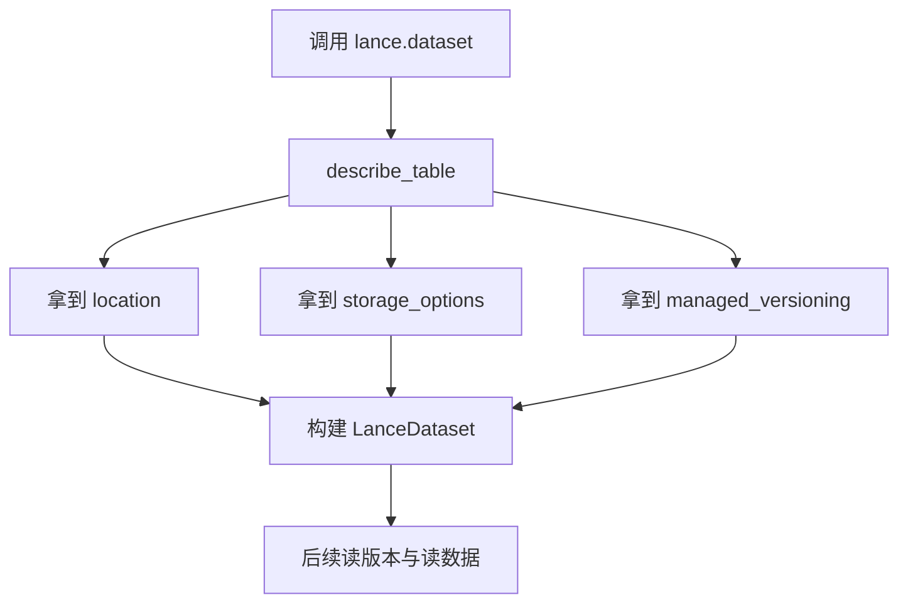
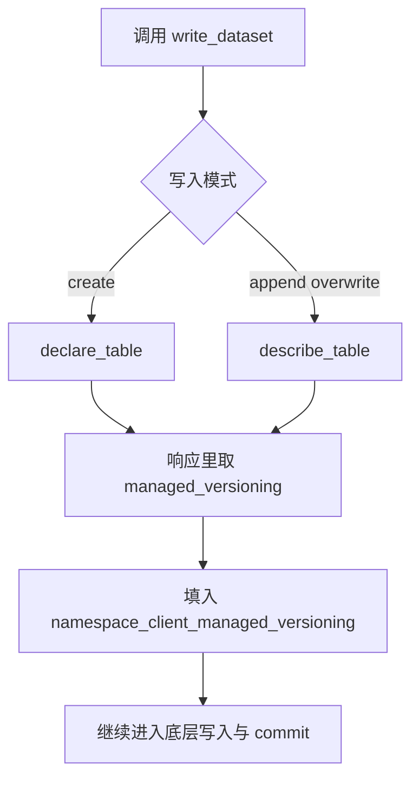
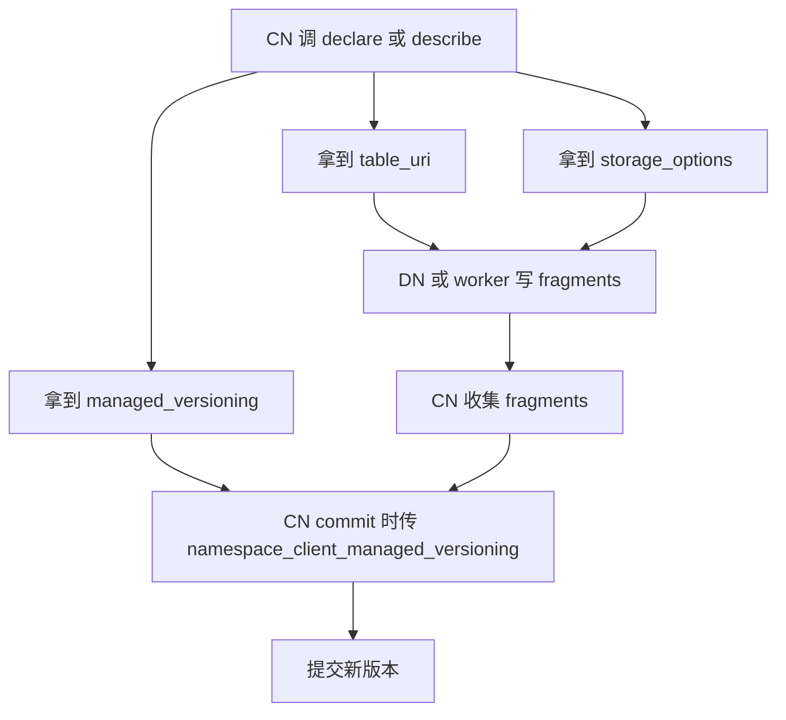

# managed_versioning 怎么生效、怎么传递、写路径里怎么用

## 版本范围

- `pylance` / `lance`：`v6.0.0`
- `lance-namespace`：`v0.7.6`

---

## 1. 先给结论

`managed_versioning=True` 不是一个你随手传给 `lance.dataset(...)` 或 `write_fragments(...)` 的独立全局开关。

它本质上是：

> **namespace 在 `describe_table(...)` / `declare_table(...)` 响应里返回给 Lance 的“版本管理由我接管”的信号。**

所以它要不要生效，关键不是“你有没有创建 namespace 对象”，而是：

1. 你的 namespace 实现会不会返回 `managed_versioning=True`
2. 你是不是走了带 `namespace_client + table_id` 的路径
3. 在低层 commit 路径里，你有没有把这个标志继续传下去

---

## 2. 它什么时候会有效？

### 2.1 `DirectoryNamespace`

`DirectoryNamespace` 可以在创建时打开这个能力。

关键属性是：

- `table_version_tracking_enabled="true"`

通常也会一起显式写：

- `manifest_enabled="true"`

示例：

```python
import lance.namespace

ns = lance.namespace.DirectoryNamespace(
    root="memory://demo",
    table_version_tracking_enabled="true",
    manifest_enabled="true",
)
```

或者：

```python
from lance_namespace import connect

ns = connect("dir", {
    "root": "memory://demo",
    "table_version_tracking_enabled": "true",
    "manifest_enabled": "true",
})
```

这里真正决定 `managed_versioning` 的，是 `table_version_tracking_enabled`。

也就是说，更准确的关系是：

- `table_version_tracking_enabled=true`
  - `describe_table(...)` / `declare_table(...)` 会返回 `managed_versioning=True`
- `table_version_tracking_enabled=false`
  - 返回里通常不会带这个标志

---

### 2.2 `RestNamespace`

`RestNamespace` 是 REST 客户端，不是本地后端实现。

所以你在客户端构造时：

```python
import lance.namespace

ns = lance.namespace.RestNamespace(uri="http://localhost:4099")
```

**并不能在这里本地强行打开 `managed_versioning=True`。**

对 `RestNamespace` 来说，是否启用 `managed_versioning`，取决于：

> **远端 namespace 服务端在 `describe_table` / `declare_table` 响应里是否返回 `managed_versioning=True`。**

所以：

- `DirectoryNamespace`：本地创建时可配置
- `RestNamespace`：客户端创建时不可本地配置，只能由服务端决定

---

## 3. 不是有两个原生接口吗？哪个能用？

内置原生实现就两个：

- `lance.namespace.DirectoryNamespace`
- `lance.namespace.RestNamespace`

`lance-namespace` 的 `connect()` 只是它们的工厂别名：

- `connect("dir", ...)` -> `lance.namespace.DirectoryNamespace`
- `connect("rest", ...)` -> `lance.namespace.RestNamespace`

### 3.1 `dir` / `DirectoryNamespace`

可以这样开：

```python
ns = connect("dir", {
    "root": "memory://demo",
    "table_version_tracking_enabled": "true",
    "manifest_enabled": "true",
})
```

### 3.2 `rest` / `RestNamespace`

可以这样连：

```python
ns = connect("rest", {
    "uri": "http://localhost:4099",
})
```

但这里没有客户端本地参数能直接“打开 managed_versioning”。

你只能在后续请求里观察：

```python
resp = ns.describe_table(...)
managed = resp.managed_versioning is True
```

---

## 4. 这个标志到底放在哪？

它首先出现在 namespace 的响应对象里。

例如：

```python
resp = ns.describe_table(...)
managed = resp.managed_versioning is True
```

或者：

```python
resp = ns.declare_table(...)
managed = resp.managed_versioning is True
```

所以你要记住：

> **`managed_versioning` 先是 namespace 响应字段，后面才会被读路径 / 写路径继续往下传。**

---

## 5. 它怎么传下去？

这块分 3 条链路看最清楚。

## 5.1 读路径：`lance.dataset(...)`

当你这样读：

```python
ds = lance.dataset(
    namespace_client=ns,
    table_id=["events"],
)
```

内部流程大致是：

1. 先调用 `describe_table(...)`
2. 拿到：
   - `location`
   - `storage_options`
   - `managed_versioning`
3. Python 层把 `namespace_client_managed_versioning` 传给 `LanceDataset(...)`
4. Rust 侧如果发现这个标志为真，会安装 namespace-managed 的 commit / version handler

### 读路径图



---

## 5.2 高层写路径：`lance.write_dataset(...)`

这是最省心的一条路。

如果你这样写：

```python
lance.write_dataset(
    table,
    namespace_client=ns,
    table_id=["events"],
    mode="create",
)
```

或：

```python
lance.write_dataset(
    table,
    namespace_client=ns,
    table_id=["events"],
    mode="append",
)
```

内部会自动做这些事：

### `mode="create"`
- 调 `declare_table(...)`
- 取 `location`
- 取 `storage_options`
- 取 `managed_versioning`
- 自动把 `namespace_client_managed_versioning` 继续传到写入 / 提交层

### `mode="append"` / `mode="overwrite"`
- 调 `describe_table(...)`
- 取 `location`
- 取 `storage_options`
- 取 `managed_versioning`
- 自动把这个标志继续传下去

### 高层写传递图



所以结论很简单：

> **高层 `write_dataset(...)` 路径里，这个标志基本是自动传下去的。**

你通常不用自己手动塞。

---

## 5.3 低层写路径：`write_fragments(...) + LanceDataset.commit(...)`

这条路就不能偷懒了。

因为 `write_fragments(...)` 自己不会替你做完整的 namespace resolution 和 managed-versioning 透传闭环。

典型流程是：

1. `declare_table(...)` 或 `describe_table(...)`
2. 拿到 `table_uri`
3. 拿到 `storage_options`
4. 拿到 `managed_versioning`
5. `write_fragments(...)`
6. `LanceDataset.commit(...)` 时手动传：
   - `namespace_client=ns`
   - `table_id=table_id`
   - `namespace_client_managed_versioning=managed`

### 低层写传递图



所以结论是：

> **低层 `write_fragments + commit` 路径里，`managed_versioning` 往往要你自己从 namespace 响应里拿出来，再传给 commit。**

---

## 6. 最实用的 write 示例

下面这部分我尽量写成“拿去就能改”的样子。

## 6.1 示例 A：`DirectoryNamespace + write_dataset(create + append)`

这个例子说明：

- 怎么在 `DirectoryNamespace` 上打开 managed versioning
- 高层 `write_dataset(...)` 怎么自动把标志传下去

见：

- `examples/write_dataset_with_managed_versioning.py`

核心思路：

```python
ns = lance.namespace.DirectoryNamespace(
    root="memory://demo",
    table_version_tracking_enabled="true",
    manifest_enabled="true",
)

lance.write_dataset(..., namespace_client=ns, table_id=table_id, mode="create")
lance.write_dataset(..., namespace_client=ns, table_id=table_id, mode="append")
```

这里你不用自己显式传 `namespace_client_managed_versioning`。

因为高层写路径会：

- 先调 namespace
- 读出 `managed_versioning`
- 再自动往下传

---

## 6.2 示例 B：`write_fragments + commit` 手动透传 managed_versioning

这个例子说明：

- 低层写路径里怎么自己拿标志
- append 提交时怎么显式带 `read_version`
- commit 时怎么继续透传 `namespace_client_managed_versioning`

见：

- `examples/write_fragments_append_with_managed_versioning.py`

核心思路：

```python
resp = ns.describe_table(...)
managed = resp.managed_versioning is True

base = lance.dataset(namespace_client=ns, table_id=table_id)
fragments = write_fragments(...)
op = lance.LanceOperation.Append(fragments)

new_ds = lance.LanceDataset.commit(
    table_uri,
    op,
    read_version=base.version,
    namespace_client=ns,
    table_id=table_id,
    namespace_client_managed_versioning=managed,
)
```

这里有两个非常关键的点：

### 点 1：append 这类操作要带 `read_version`

否则你拿旧快照追加时，系统无法判断你是不是基于正确版本提交。

### 点 2：低层 commit 时别忘了把 managed 标志带上

如果你只传了：

- `namespace_client`
- `table_id`

但没把 `namespace_client_managed_versioning` 继续传下去，语义就可能不完整。

---

## 6.3 示例 C：`RestNamespace` 怎么看这个标志

对于 REST 客户端，重点不是“怎么打开”，而是“怎么观察和透传”。

```python
from lance_namespace import DescribeTableRequest, connect

ns = connect("rest", {"uri": "http://localhost:4099"})
table_id = ["workspace", "events"]

resp = ns.describe_table(DescribeTableRequest(id=table_id))
managed = resp.managed_versioning is True
print("managed_versioning:", managed)
```

如果这里打印出来是：

- `True`：说明服务端要你走 namespace-managed versioning
- `False` / `None`：说明服务端没有打开这条语义

---

## 7. 常见误区

### 误区 1：以为创建了 namespace 对象就自动开启了 managed versioning

不是。

- `DirectoryNamespace` 要开 `table_version_tracking_enabled`
- `RestNamespace` 要看服务端响应

---

### 误区 2：以为 `write_fragments(...)` 会自动把整条 managed-versioning 链路做好

不是。

`write_fragments(...)` 只是低层 fragment 产出接口。

真正的 commit 语义，尤其是 `namespace_client_managed_versioning`，通常要你在 commit 时继续明确传递。

---

### 误区 3：以为只要传了 `namespace_client`，就一定会走 namespace 管理版本

也不是。

关键还要看：

- namespace 响应里是不是 `managed_versioning=True`

如果不是，还是会回到 Lance 原生版本语义。

---

### 误区 4：以为直接用裸 `uri` 也会吃到 namespace 这套语义

如果你直接这样用：

```python
lance.dataset("s3://bucket/table.lance")
```

或者 commit 时只走裸 `table_uri`，不带 namespace 上下文，那 namespace 的这套信号大概率就根本没参与。

---

## 8. 最后压一句最重要的

### 高层写

> **`write_dataset(...)` 会帮你自动读取并继续传递 `managed_versioning`。**

### 低层写

> **`write_fragments(...)` 不会替你自动完成整条 managed-versioning 透传链路；你通常需要把 `resp.managed_versioning` 自己传给 `LanceDataset.commit(...)`。**

### 两个原生实现

> **`DirectoryNamespace` 可以在创建时通过 `table_version_tracking_enabled="true"` 打开；`RestNamespace` 不能在客户端本地打开，只能由服务端响应决定。**

---

## 9. 关键源码定位

- `/root/.openclaw/workspace/_lance_namespace_src_v0.7.6/python/lance_namespace/lance_namespace/__init__.py`
  - `NATIVE_IMPLS` / `connect()`：`dir`、`rest` 的工厂映射
- `/root/.openclaw/workspace/_lance_src_v6.0.0/python/python/lance/namespace.py`
  - `DirectoryNamespace` / `RestNamespace` Python 包装层
- `/root/.openclaw/workspace/_lance_src_v6.0.0/rust/lance-namespace-impls/src/dir.rs`
  - `table_version_tracking_enabled`
  - `describe_table` / `declare_table` 返回 `managed_versioning`
- `/root/.openclaw/workspace/_lance_src_v6.0.0/python/python/lance/__init__.py`
  - `lance.dataset(...)` 从 `describe_table(...)` 读取 `managed_versioning` 并传给 `LanceDataset`
- `/root/.openclaw/workspace/_lance_src_v6.0.0/python/python/lance/dataset.py`
  - `write_dataset(...)` 读取 `managed_versioning` 并传给底层写入
  - `LanceDataset.commit(...)` 接收 `namespace_client_managed_versioning`
- `/root/.openclaw/workspace/_lance_src_v6.0.0/rust/lance/src/dataset/builder.rs`
  - `managed_versioning=True` 时安装 external manifest commit handler
