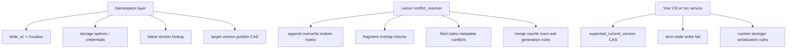

# Namespace 接入后的事务冲突矩阵：谁处理什么、先后顺序会怎样

## 版本范围

- `pylance` / `lance`：`v6.0.0`
- `lance-namespace`：`v0.7.6`

---

## 1. 先给结论

如果你问的是：

> **“接入 namespace 之后，并发事务冲突到底是谁处理？完整矩阵是什么？先执行谁、后执行谁会怎样？”**

最准确的结论是：

1. **事务冲突矩阵的核心判定器是 Lance 的 `TransactionRebase` / `conflict_resolver`，不是 namespace。**
2. **这个矩阵是有方向的。** 它判断的是：
   - **当前准备提交的事务** `current op`
   - 去检查 **已经先提交成功的事务** `committed op`
3. **namespace 接入后，这套矩阵仍然生效。** namespace 主要替换的是：
   - latest version 查询
   - `create_table_version(...)` 版本发布
4. **namespace 解决的核心问题不是事务语义矩阵本身，而是表解析、存储配置下发、managed versioning 接入、目标 version 发布 CAS。**

一句话压缩：

> **namespace 管“版本发布与表元数据入口”，Lance 管“事务语义冲突矩阵”。**

---

## 2. 怎么读这张矩阵

### 2.1 方向非常关键

这不是对称矩阵。

正确读法是：

> **A -> B** = `A` 先提交成功，`B` 后提交；此时用 **B 的 conflict checker** 去检查已经提交的 **A**。

所以：

- `append -> overwrite`
  - 意思是：append 先成了已提交事务，overwrite 后提交
  - 这时看的是 **`check_overwrite_txn(committed=append)`**
- `overwrite -> append`
  - 意思是：overwrite 先提交，append 后提交
  - 这时看的是 **`check_append_txn(committed=overwrite)`**

这两个结论可能完全不同。

### 2.2 结果不是二值，而是三态

`conflict_resolver` 里实际是 3 态：

- **Compatible**：兼容，可继续提交
- **Retryable**：存在冲突，但允许 rebase / retry / 重算后再试
- **Incompatible**：语义硬冲突，不应自动继续

测试里也直接用了这三类：

- `ConflictResult::Compatible`
- `ConflictResult::Retryable`
- `ConflictResult::NotCompatible`

源码：

- 入口调度：`rust/lance/src/io/commit/conflict_resolver.rs:188-226`
- 测试子矩阵：`rust/lance/src/io/commit/conflict_resolver.rs:2187-2642`

---

## 3. namespace 到底接管了 commit 的哪一段

当 `managed_versioning=true` 时，Lance 会安装 `LanceNamespaceExternalManifestStore`，把版本查询 / 版本发布切到 namespace。

关键源码：

- dataset 安装 namespace external manifest handler：
  - `rust/lance/src/dataset.rs:797-807`
  - `rust/lance/src/dataset.rs:854-865`
- namespace-backed manifest store：
  - `rust/lance/src/io/commit/namespace_manifest.rs:33-120`

这个 store 会直接调用：

- `list_table_versions(...)`
- `describe_table_version(...)`
- `create_table_version(...)`

非常关键的一点：

> **namespace-backed store 不是走通用 `put_if_not_exists -> copy -> put_if_exists` 流程。**

它直接 override 了 `put(...)`，并把：

- `put_if_not_exists`
- `put_if_exists`

都明确标成 unsupported。

源码：

- `rust/lance/src/io/commit/namespace_manifest.rs:73-100`
- `rust/lance/src/io/commit/namespace_manifest.rs:123-146`

所以接入 namespace 后：

### namespace 真正接管的

- `table_id -> location` 的解析
- `storage_options / credentials` 传递
- `managed_versioning` 的宣告
- latest version 查询
- **目标 version 的发布占位冲突**（`create_table_version(...)`）

### namespace 没接管的

- `append / overwrite / restore / update / delete / rewrite / merge ...` 的事务兼容矩阵
- fragment overlap / field overlap / metadata overlap 的冲突判断
- 严格的 `read_version == expected_current_version` 乐观锁

也就是说：

> **接了 namespace，不等于把事务冲突语义外包给 namespace。**

---

## 4. namespace 自己能解决哪些冲突

这部分是 namespace 的核心价值，但它不是完整事务矩阵。

### 4.1 并发 `declare_table(...)`

`DirectoryNamespace::declare_table(...)` 会原子创建 `.lance-reserved` 标记文件，用 `PutMode::Create` / put-if-not-exists 语义避免并发声明撞车。

源码：

- marker file helper：`rust/lance-namespace-impls/src/dir.rs:1916-1938`
- `declare_table(...)`：`rust/lance-namespace-impls/src/dir.rs:2636-2663`

### 4.2 已存在表再次 `create_table(...)`

`create_table(...)` 会在写表前后检查实际 manifest 是否已存在，重复创建会报 `TableAlreadyExists`。

源码：

- `rust/lance-namespace-impls/src/dir.rs:2559-2586`

### 4.3 重复创建同名 index

`create_table_index(...)` 会把底层 duplicate index 错误包装成 `TableIndexAlreadyExists`。

源码：

- `rust/lance-namespace-impls/src/dir.rs:3094-3134`

### 4.4 同一个目标 version 被重复发布

`create_table_version(...)` 的关键语义是：

- 先算最终 manifest 路径
- 对最终路径做 `copy_if_not_exists(...)`
- 不支持则 fallback 到 `PutMode::Create`
- 已存在则报 `ConcurrentModification`

源码：

- `rust/lance-namespace-impls/src/dir.rs:2809-2879`
- 测试：`rust/lance-namespace-impls/src/dir.rs:7685-7801`

所以 namespace 的核心 commit 价值是：

> **它能防止两个 writer 抢同一个目标 version slot。**

但它**不是**完整事务冲突矩阵的来源。

---

## 5. 完整事务冲突矩阵的入口：谁在判定

完整入口在：

- `rust/lance/src/io/commit/conflict_resolver.rs:193-225`

这里按 **current op** 分发到对应 checker：

- `check_delete_txn`：`228-326`
- `check_update_txn`：`328-488`
- `check_create_index_txn`：`490-642`
- `check_rewrite_txn`：`643-824`
- `check_overwrite_txn`：`825-871`
- `check_append_txn`：`873-899`
- `check_data_replacement_txn`：`901-984`
- `check_merge_txn`：`986-1013`
- `check_restore_txn`：`1015-1039`
- `check_reserve_fragments_txn`：`1041-1064`
- `check_project_txn`：`1066-1093`
- `check_update_config_txn`：`1095-1154`
- `check_update_mem_wal_state_txn`：`1156-1225`
- `check_add_bases_txn`：`1227-1267`
- `Clone`：入口直接 `Ok(())`

---

## 6. 完整矩阵怎么写最准确

这张“完整矩阵”不是单纯 15 × 15 的布尔表，而是：

> **操作类型矩阵 + fragment overlap 条件 + field overlap 条件 + metadata key 条件 + generation 条件**

所以最准确的写法不是“一个格子一个字”，而是：

- 当前事务是什么
- 已提交事务是什么
- 结果是 Compatible / Retryable / Incompatible
- 如果是条件型，要把条件也写出来

下面这张总表就是按这个方式整理的。

---

## 7. 完整事务冲突矩阵（按 current op 分组）

> 读法提醒：下面每一行都是 **current op 去看 committed op**。

| Current op | Compatible | Retryable / 条件型 | Incompatible | 关键源码 |
| --- | --- | --- | --- | --- |
| **Append** | Append, CreateIndex, Delete, Rewrite, DataReplacement, Merge, ReserveFragments, Update, Project, UpdateConfig, Clone, UpdateBases | — | Overwrite, Restore, UpdateMemWalState | `873-899` |
| **Overwrite** | Append, Delete, CreateIndex, Rewrite, DataReplacement, Merge, Restore, ReserveFragments, Update, Project, Clone, UpdateBases；`UpdateConfig` 在 **无 upsert-key/schema/field metadata 冲突** 时兼容 | Overwrite（一般 retryable） | UpdateMemWalState；以及与 Overwrite / UpdateConfig 的特定 key/schema metadata 冲突时 | `825-871`, `1095-1154` |
| **Restore** | Append, Delete, Overwrite, CreateIndex, Rewrite, DataReplacement, Merge, Restore, ReserveFragments, UpdateBases, Update, Project, Clone, UpdateConfig | — | UpdateMemWalState | `1015-1039` |
| **Delete** | Append, CreateIndex, ReserveFragments, Clone, Project, UpdateConfig, UpdateBases；Rewrite/DataReplacement/Delete/Update 在 **不碰同一批 fragment** 时兼容 | Rewrite / DataReplacement / Delete / Update 在 **fragment 重叠** 时 retryable；Merge retryable | Overwrite, Restore, UpdateMemWalState | `228-326` |
| **Update** | CreateIndex, ReserveFragments, Project, Clone, UpdateConfig, UpdateBases；Append 在 **无 inserted_rows_filter 限制** 时兼容；Rewrite/DataReplacement/Delete/Update 在 **不碰同一批 fragment** 时兼容；UpdateMemWalState 在 **无 merged_generation 冲突** 时兼容 | Append 在 **有 inserted_rows_filter** 时 retryable；Rewrite/DataReplacement/Delete/Update 在 **fragment 重叠** 时 retryable；Merge retryable；UpdateMemWalState 在 generation 冲突时可能 retryable | Overwrite, Restore；某些 merged_generation 情况会转成 incompatible | `328-488`, `1270-1294` |
| **CreateIndex** | Append, Delete, Update, Merge, ReserveFragments, Project, UpdateConfig, Clone, UpdateBases；CreateIndex 在 **无同名 index / 特殊系统 index 冲突** 时兼容；Rewrite / DataReplacement / UpdateMemWalState 在安全条件下可兼容 | CreateIndex 同名冲突 retryable；Rewrite 触到 indexed fragments / frag_reuse_index 相关情形时 retryable；DataReplacement 改到被建索引字段时 retryable；CreateIndex(MemWalIndex) 与 UpdateMemWalState generation 冲突时 retryable | Overwrite, Restore；UpdateMemWalState（当前 CreateIndex 不是 MemWalIndex 时） | `490-642`, `1270-1294` |
| **Rewrite** | Append, ReserveFragments, Project, Clone, UpdateConfig, UpdateMemWalState, UpdateBases；Delete/Update 在 **不碰相同 old fragments** 时兼容；Rewrite 在 **不碰相同 old fragments 且不同时生成冲突 frag_reuse_index** 时兼容；CreateIndex 在 **不触及相关 bitmap / FRI 安全** 时兼容；DataReplacement 在 **不替换相同 fragment** 时兼容 | Delete / Update / Rewrite / CreateIndex / DataReplacement / Merge 在对应 overlap 条件下 retryable | Overwrite, Restore | `643-824` |
| **DataReplacement** | Append, Delete, Update, Merge, UpdateConfig, ReserveFragments, Project, Clone, UpdateBases | CreateIndex 改到同字段时 retryable；Rewrite 触到同 fragment 时 retryable；DataReplacement 在 **同 fragment + 同字段** 时 retryable | Overwrite, Restore, UpdateMemWalState | `901-984` |
| **Merge** | CreateIndex, ReserveFragments, Clone, UpdateConfig, UpdateBases | Append, Delete, Update, Rewrite, Merge, DataReplacement retryable | Overwrite, Restore, Project, UpdateMemWalState | `986-1013` |
| **ReserveFragments** | Append, Delete, CreateIndex, Rewrite, DataReplacement, Merge, ReserveFragments, Update, Project, Clone, UpdateConfig, UpdateMemWalState, UpdateBases | — | Overwrite, Restore | `1041-1064` |
| **Project** | Append, Update, Delete, UpdateConfig, CreateIndex, DataReplacement, Rewrite, Clone, ReserveFragments, UpdateBases | Merge, Project retryable | Overwrite, Restore, UpdateMemWalState | `1066-1093` |
| **UpdateConfig** | Append, Delete, CreateIndex, Rewrite, DataReplacement, Merge, Restore, ReserveFragments, Update, Project, Clone, UpdateMemWalState, UpdateBases；Overwrite 在 **不碰 schema/field metadata 且无 upsert-key 冲突** 时兼容；UpdateConfig 在 **不改相同 key / metadata** 时兼容 | — | Overwrite（特定 metadata/upsert-key 冲突）；UpdateConfig（相同 key 或 metadata 冲突） | `1095-1154` |
| **UpdateMemWalState** | UpdateConfig, Rewrite, ReserveFragments, UpdateBases；CreateIndex **若不是 MemWalIndex** 则兼容；另一个 UpdateMemWalState / 带 merged_generations 的 Update / MemWalIndex CreateIndex 在无 generation 冲突时兼容 | UpdateMemWalState / Update / MemWalIndex CreateIndex 在 generation 落后时 retryable | Append, Overwrite, Delete, DataReplacement, Merge, Restore, Clone, Project；某些 generation 情况也会 incompatible | `1156-1225`, `1270-1294` |
| **UpdateBases** | 除 `UpdateBases` 特定碰撞外，和其他数据类操作都兼容 | — | UpdateBases 在 **相同 id / name / path** 时 incompatible | `1227-1267` |
| **Clone** | 全兼容 | — | — | `193-225` |

---

## 8. 最值得记住的“先后顺序”例子

下面这些例子最能说明“方向性”。

### 8.1 `append -> append`

- 第一个 append 先提交
- 第二个 append 后提交
- 第二个 append 去看 committed append：**Compatible**
- 常见结果：后者 rebase 后形成新版本

源码：

- `check_append_txn`：`rust/lance/src/io/commit/conflict_resolver.rs:873-899`
- 并发 append 测试：`rust/lance/src/io/commit.rs:1439-1492`

结论：

> **append 先后并不天然互斥。**

### 8.2 `overwrite -> append`

- overwrite 先提交
- append 后提交
- 当前 append 看到 committed overwrite：**Incompatible**

源码：

- `rust/lance/src/io/commit/conflict_resolver.rs:878-885`

结论：

> **overwrite 先落地后，后来的 append 不能直接跟上去。**

### 8.3 `append -> overwrite`

- append 先提交
- overwrite 后提交
- 当前 overwrite 看到 committed append：**Compatible**

源码：

- `rust/lance/src/io/commit/conflict_resolver.rs:858-869`

结论：

> **overwrite 作为后提交者，通常可以压在 append 后面形成更新版本。**

### 8.4 `restore -> append`

- restore 先提交
- append 后提交
- 当前 append 看到 committed restore：**Incompatible**

源码：

- `rust/lance/src/io/commit/conflict_resolver.rs:879-884`

### 8.5 `append -> restore`

- append 先提交
- restore 后提交
- 当前 restore 看到 committed append：**Compatible**

源码：

- `rust/lance/src/io/commit/conflict_resolver.rs:1020-1034`

这两个放一起看就很清楚：

> **append vs restore 不是对称互斥，而是明显有方向。**

### 8.6 `rewrite(same fragments) -> update`

- rewrite 先提交，且碰到了 update 关心的同一批 fragment
- 当前 update 去看 committed rewrite：**Retryable**

源码：

- Update 检查 rewrite：`rust/lance/src/io/commit/conflict_resolver.rs:398-407`
- Rewrite 检查 update：`rust/lance/src/io/commit/conflict_resolver.rs:664-683`

### 8.7 `create_index(same name) -> create_index`

- 同名 index 并发创建
- 后提交者通常：**Retryable**

源码：

- `rust/lance/src/io/commit/conflict_resolver.rs:505-539`

### 8.8 `update_config(same key) -> update_config`

- 两边改同一个 config key 或同一块 schema/field metadata
- 后提交者：**Incompatible**

源码：

- `rust/lance/src/io/commit/conflict_resolver.rs:1122-1135`
- 测试子矩阵：`rust/lance/src/io/commit/conflict_resolver.rs:2490-2642`

### 8.9 `update_bases(same id/name/path) -> update_bases`

- 两边往 bases 里加相同 id / name / path
- 后提交者：**Incompatible**

源码：

- `rust/lance/src/io/commit/conflict_resolver.rs:1232-1257`

---

## 9. 这套矩阵在接入 namespace 后还能做什么？

答案是：

> **能做的事务语义，和没接 namespace 时本质上一样；namespace 不会替换掉它。**

也就是说：

### 没接 namespace / `managed_versioning=false`

- latest version / final commit 走 Lance 原生路径
- **事务冲突矩阵仍然是这套 `conflict_resolver`**

### 接了 namespace / `managed_versioning=true`

- latest version 查询走 namespace
- `create_table_version(...)` 版本发布走 namespace
- **事务冲突矩阵仍然还是这套 `conflict_resolver`**

所以接 namespace 后，你获得的是：

- table-id 风格入口
- 统一 location / storage_options / credentials
- latest version 交给 namespace
- 目标 version 发布 CAS 交给 namespace

你**没有自动获得**的是：

- 更强的 append/overwrite/restore 事务规则
- “后提交者必须失败”的 stale writer 语义
- 完整 `read_version` 级乐观锁

---

## 10. namespace 是不是能解决这些冲突的核心问题？

### 10.1 是，但只对一层

如果你说的“核心问题”是：

- 多 CN / 多 DN 或 namespace-aware client 下，**谁来当版本发布的 source of truth**
- **同一个目标 version 不能被重复占用**
- **table_id / location / storage_options** 谁统一下发

那：

> **是，namespace 很核心。**

### 10.2 不是，如果你说的是事务语义矩阵

如果你说的“核心问题”是：

- append / overwrite / restore 谁和谁兼容
- rewrite / update / delete / merge 是否能并发
- overlap 时到底是 retryable 还是 incompatible

那：

> **不是，核心判定器仍然是 Lance `conflict_resolver`。**

### 10.3 还差最后一层：严格 stale writer fail

如果你的目标是：

> **两个 writer 都基于同一个 `read_version=M` 出发，先提交者成功，后提交者必须失败**

那仅靠：

- namespace
- `create_table_version(...)`
- Lance conflict_resolver

都还不够。

因为 `CreateTableVersionRequest` 只有：

- `version`
- `manifest_path`
- `manifest_size`
- `e_tag`
- `naming_scheme`

没有 `expected_current_version` 之类字段。

源码：

- `../_lance_namespace_src_v0.7.6/rust/lance-namespace-reqwest-client/src/models/create_table_version_request.rs:14-58`

所以这层通常要由你们自己的：

- CN
- namespace service
- 外部事务服务

额外补一层 CAS。

---

## 11. 一张总的分层图

---

## 12. 最后一句话总结

> **接入 namespace 后，你仍然使用 Lance 的完整事务冲突矩阵；namespace 解决的是表入口与版本发布这一层，不是事务语义本身。**

再压一句：

> **如果你要的是“完整事务矩阵”，看 `conflict_resolver.rs`；如果你要的是“namespace 的核心价值”，看 `dataset.rs + namespace_manifest.rs + create_table_version(...)` 这条链路。**
