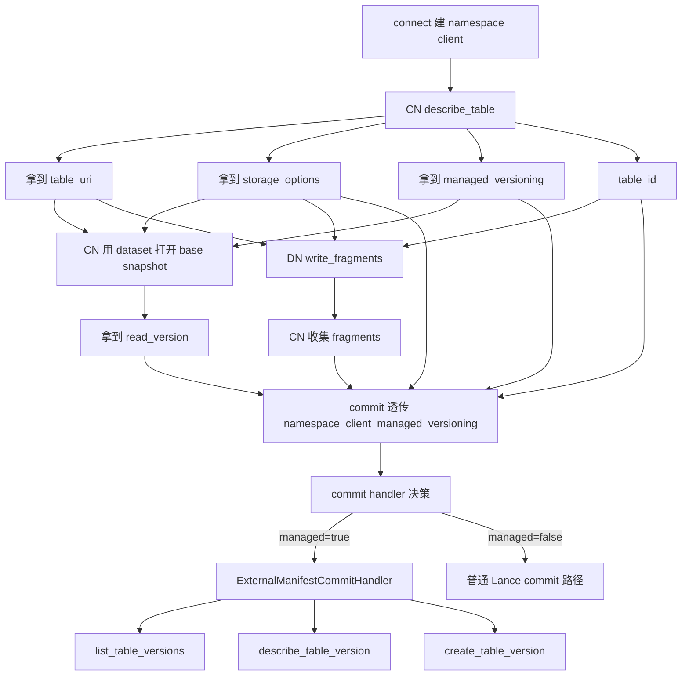

# 从 `connect(...)` 到 `write_fragments(...) + commit(...)`：namespace-aware 低层写链路全景

## 版本范围

- `pylance` / `lance`: `v6.0.0`
- `lance-namespace`: `v0.7.6`

---

## 1. 这篇文档解决什么问题

这篇只讲一条链：

> **CN 先通过 namespace 打开 / 解析表，再走低层 `write_fragments(...) + LanceDataset.commit(...)` 完成分布式写。**

重点不是高层 `write_dataset(...)`，而是你们这种更像 **single CN / multi DN** 的集成方式：

1. `connect(...)` 怎么配
2. `dataset(...)` 打开时到底发生了什么
3. `location / storage_options / managed_versioning` 怎么拿、怎么传
4. `write_fragments(...)` 这层到底用 namespace 做什么
5. `commit(...)` 最后必须传什么参数
6. 真正命中的底层 namespace API 是哪些

如果只看一句话：

> **低层路径里，`namespace_client` 不是“传进去就完事”的装饰参数；你必须把 namespace 返回的 `location`、`storage_options`、`managed_versioning` 明确接住，并继续透传到 fragment 写入和最终 commit。**

---

## 2. 一页结论

对 **已有表的 append / overwrite / distributed write**，推荐你们的 canonical 路径就是：

```python
from lance_namespace import connect, DescribeTableRequest
import lance
import pyarrow as pa
from lance.fragment import write_fragments

# 1) 连接 namespace
ns = connect("rest", {"uri": "http://localhost:4099"})
table_id = ["workspace", "events"]

# 2) 先解析表上下文（推荐 CN 显式做一次）
resp = ns.describe_table(DescribeTableRequest(id=table_id))
if not resp.location:
    raise RuntimeError("namespace did not return table location")

table_uri = resp.location
storage_options = dict(resp.storage_options or {})
managed = resp.managed_versioning is True

# 3) 再通过 dataset 打开最新版本，拿 read_version / base snapshot
base = lance.dataset(namespace_client=ns, table_id=table_id)

# 4) DN / worker 写 fragment
fragments = write_fragments(
    pa.Table.from_pylist([
        {"id": 3, "name": "c"},
        {"id": 4, "name": "d"},
    ]),
    table_uri,
    storage_options=storage_options,
    namespace_client=ns,
    table_id=table_id,
)

# 5) CN 收口后统一 commit
op = lance.LanceOperation.Append(fragments)
new_ds = lance.LanceDataset.commit(
    table_uri,
    op,
    read_version=base.version,
    storage_options=storage_options,
    namespace_client=ns,
    table_id=table_id,
    namespace_client_managed_versioning=managed,
)
```

这条链里最关键的 4 个值是：

- `namespace_client`
- `table_id`
- `storage_options`
- `namespace_client_managed_versioning`

其中最容易漏的是最后一个：

> **低层 `commit(...)` 不会自己重新去 `describe_table(...)` 帮你判断 managed versioning。**
> 你要自己把 `resp.managed_versioning is True` 的结果继续传进去。

---

## 3. 先把角色分清楚

在这条低层链路里，namespace 一共扮演 3 种角色：

### 3.1 控制面 / catalog
负责：

- `table_id -> location`
- 返回 `storage_options`
- 返回 `managed_versioning`

也就是：

- 表在哪
- 该怎么访问
- 版本发布是不是由 namespace 接管

### 3.2 凭证 / 存储参数提供方
当返回值里带有 `storage_options` 时，Lance 可以基于它去访问对象存储。

在某些路径里，`namespace_client + table_id` 还会被用来创建动态 `StorageOptionsProvider`，用于 credential refresh。

### 3.3 版本注册接口
只有在 `managed_versioning=True` 时这层最关键：

- open latest -> `list_table_versions(...)`
- open version=N -> `describe_table_version(...)`
- commit publish -> `create_table_version(...)`

---

## 4. Step 0：`connect(...)` 从哪里开始配

`connect(...)` 只是 namespace client 的工厂入口。

### 4.1 生产集成通常是 `rest`

```python
from lance_namespace import connect

ns = connect("rest", {
    "uri": "http://localhost:4099",
    # 可选: "delimiter": "$",
    # 可选: "header.Authorization": "Bearer ...",
})
```

常见参数作用：

| 参数 | 作用 | 是否关键 |
|---|---|---|
| `uri` | namespace 服务地址 | 必需 |
| `delimiter` | namespace 层级分隔符 | 可选 |
| `header.*` | 请求头透传 | 可选 |
| `tls.*` | TLS 配置 | 可选 |

注意：

> 对 `RestNamespace` 来说，`managed_versioning` **不是你在 connect 时本地打开的**，而是后续 `describe_table(...)` / `declare_table(...)` 响应返回的能力信号。

也就是说：

- `connect("rest", ...)` 只是“连上服务”
- 是否启用 namespace-managed versioning，取决于**服务端返回**

上游入口说明见：

- `python/python/lance/namespace.py:863-899`

---

### 4.2 本地验证 / probe 通常是 `dir`

```python
ns = connect("dir", {
    "root": "memory://demo",
    "table_version_tracking_enabled": "true",
    "manifest_enabled": "true",
    # 可选，用于更深的 probe：
    # "table_version_storage_enabled": "true",
    # "ops_metrics_enabled": "true",
})
```

常见参数作用：

| 参数 | 作用 | 是否关键 |
|---|---|---|
| `root` | namespace 后端根路径 | 必需 |
| `table_version_tracking_enabled` | 让 `describe_table/declare_table` 返回 `managed_versioning=True` | **关键** |
| `manifest_enabled` | 开启 manifest 元数据能力 | 常与上面一起开 |
| `table_version_storage_enabled` | 让 version lookup 尽量走 `__manifest` 存储路径 | probe 可选 |
| `ops_metrics_enabled` | 记录 namespace API 调用次数 | probe 可选 |

上游参数说明见：

- `python/python/lance/namespace.py:311-339`

---

## 5. Step 1：CN 先拿表上下文

虽然你可以直接写：

```python
base = lance.dataset(namespace_client=ns, table_id=table_id)
```

但在 **低层 `write_fragments + commit` 路径** 里，我更建议 CN 先显式做一次：

```python
from lance_namespace import DescribeTableRequest

resp = ns.describe_table(DescribeTableRequest(id=table_id))
```

然后把这 3 个值拿出来：

```python
table_uri = resp.location
storage_options = dict(resp.storage_options or {})
managed = resp.managed_versioning is True
```

### 为什么推荐先显式 `describe_table(...)`

因为后面 2 个低层步骤都要用到它：

1. `write_fragments(...)` 需要真实 `table_uri`
2. `commit(...)` 需要你显式继续传 `namespace_client_managed_versioning=managed`

也就是说，**就算你后面也会 `lance.dataset(...)` 打开表**，这个显式 `describe_table(...)` 仍然有价值：

- 它把 control-plane 返回值显式落到你自己的 CN 上下文里
- 方便你把 `table_uri / storage_options` 下发给 DN
- 方便你把 `managed` 明确传到最终 commit

---

## 6. Step 2：`lance.dataset(...)` 打开表时到底发生了什么

推荐这样打开：

```python
base = lance.dataset(
    namespace_client=ns,
    table_id=table_id,
)
```

这一步的主要目的通常是：

- 拿到当前 base snapshot
- 拿到 `base.version`，供 append / merge / update 这类提交使用
- 验证 namespace 读路径是否正常

### 6.1 Python 层实际做的事

`lance.dataset(...)` 在 Python 入口里会先：

1. 校验 `uri` 和 `namespace_client/table_id` 不能混用
2. 调 `DescribeTableRequest(id=table_id, version=version)`
3. 调 `namespace_client.describe_table(...)`
4. 从响应里取：
   - `location`
   - `storage_options`
   - `managed_versioning`
5. 构造 `LanceDataset(...)`，并把
   - `namespace_client`
   - `table_id`
   - `namespace_client_managed_versioning`
   传进去

源码落点：

- `python/python/lance/__init__.py:189-254`

### 6.2 Rust 侧实际做的事

`LanceDataset(...)` 在 Rust builder 里会继续：

1. 如果有 `storage_options`，创建 `LanceNamespaceStorageOptionsProvider`
2. 把它塞进 `StorageOptionsAccessor`
3. 如果 `namespace_client_managed_versioning=True`
   - 构造 `LanceNamespaceExternalManifestStore`
   - 再包成 `ExternalManifestCommitHandler`
   - 装进 dataset builder

源码落点：

- `python/src/dataset.rs:777-804`

### 6.2.1 如果是在 DN 上打开 `LanceDataset`，它怎么知道 `managed_versioning=True`

这里最容易误解。

答案不是：

- DN 上的 `LanceDataset` 会自己从 `table_uri` 推导出 `managed_versioning=True`

而是：

- **只要 DN 也是通过 `lance.dataset(namespace_client=ns, table_id=table_id)` 打开的**，它就会像 CN 一样，先走一次 `describe_table(...)`，然后直接从 namespace 响应里取：

```python
namespace_client_managed_versioning = (
    getattr(response, "managed_versioning", None) is True
)
```

也就是说，DN 本地这个布尔值的来源仍然是：

- `describe_table(...)` 响应
- 不是 `LanceDataset` 自己从 URI 反推
- 也不是 `write_fragments(...)` 阶段自动帮你补出来

然后 Python 层会把这个值继续传给 `LanceDataset(...)`，再由 `LanceDataset.__init__` 保存在：

- `self._namespace_client_managed_versioning`

对应位置：

- Python 读值并传入：`python/python/lance/__init__.py:204-255`
- Python 对象保存字段：`python/python/lance/dataset.py:602-625`
- Rust builder 根据该布尔值装 handler：`python/src/dataset.rs:777-804`

所以结论很明确：

> **DN 如果自己 open dataset，它知道 `managed_versioning=True` 的方式，仍然是“自己再问一次 namespace”。**

不是靠别的隐式魔法。

### 6.2.2 这个值不会可靠地跟着 `LanceDataset` 跨进程传播

先把话说直白一点：

> **这里不是推荐 CN 把 `LanceDataset` 对象传给 DN。**
> **更推荐的做法是：DN 自己打开，或者 DN 根本不需要打开。**

这里说的“跨进程传播”，指的是 Python 对象跨了进程边界，例如：

- `multiprocessing`
- `ProcessPoolExecutor`
- worker queue / pipe
- Ray / actor / remote worker

这类场景里，Python 往往会先把对象做一次序列化（pickle），另一边再反序列化恢复。

如果只是同进程 `copy.copy(ds)`：

- `_namespace_client`
- `_table_id`
- `_namespace_client_managed_versioning`

是会保留的。

对应位置：

- `python/python/lance/dataset.py:702-715`

但如果是序列化 / pickle / 跨进程恢复，`__setstate__` 恢复对象时会把这些 namespace 相关字段重置掉：

```python
self._namespace_client = None
self._table_id = None
self._namespace_client_managed_versioning = False
```

对应位置：

- `python/python/lance/dataset.py:651-700`

所以这段真正想表达的是：

> **不要把 `LanceDataset` 对象本身当成跨 worker / 跨 DN 的 control-plane 上下文载体。**

不是说“CN 一定会把 dataset 传给 DN”，而是说：

- **如果你这么做，这些 namespace 状态不保证还能保住**
- 所以这不是稳妥集成方式

对 CN / DN 分工，更推荐下面两种：

### 模式 A：DN 不打开 dataset，只负责 `write_fragments(...)`

这是最常见也最干净的模式。

CN 显式持有：

- `table_uri`
- `storage_options`
- `table_id`
- `managed_versioning`
- `read_version`

DN 只拿：

- `table_uri`
- `storage_options`
- `table_id`
- 自己的 shard / task 上下文

然后直接：

```python
write_fragments(..., table_uri, storage_options=..., namespace_client=ns, table_id=table_id)
```

这种模式下，DN 根本不需要关心 `managed_versioning`。

### 模式 B：DN 自己独立打开 dataset

如果 DN 确实需要 open dataset，也完全可以自己这样开：

```python
ds = lance.dataset(namespace_client=ns, table_id=table_id)
```

这时它会像 CN 一样：

1. 自己调一次 `describe_table(...)`
2. 自己从响应里取 `managed_versioning`
3. 自己把该值存进本地 `LanceDataset`

也就是说：

> **DN 自己打开是没问题的；不推荐的是“把 CN 打开的 `LanceDataset` 对象直接传给 DN 再指望里面状态还能自动保留”。**

所以对分布式链路，应该显式传的是：

- `table_uri`
- `storage_options`
- `table_id`
- `managed_versioning`
- `read_version`

而不是把 `LanceDataset` 对象本身当成 control-plane 上下文载体。

### 6.3 这一步命中的 namespace API

如果你打开 latest：

- 先 `describe_table(...)`
- 再在 external manifest store 里 `list_table_versions(...)`

如果你打开指定版本：

- 先 `describe_table(...)`
- 再 `describe_table_version(...)`

对应实现：

- `rust/lance/src/io/commit/namespace_manifest.rs:33-71`

---

## 7. Step 3：DN / worker 走 `write_fragments(...)`

低层 fragment 写入长这样：

```python
from lance.fragment import write_fragments

fragments = write_fragments(
    data,
    table_uri,
    storage_options=storage_options,
    namespace_client=ns,
    table_id=table_id,
    mode="append",
)
```

这里要先记住一句：

> **`write_fragments(...)` 不负责 `table_id -> table_uri` 解析。**

所以：

- `dataset_uri` / `table_uri` 必须是你前面已经从 namespace 拿到的真实位置
- `namespace_client + table_id` 在这里的主要作用，不是找表，而是创建 storage options provider，用于对象存储访问 / credential refresh

### 7.1 这几个参数分别干啥

| 参数 | 作用 | 是否关键 |
|---|---|---|
| `data` | 要写成 fragment 的数据 | 必需 |
| `table_uri` | 真实物理表路径 | **必需** |
| `storage_options` | 初始对象存储访问参数 | **强烈建议显式传** |
| `namespace_client` | 用于创建动态 storage options provider | 推荐 |
| `table_id` | 提供给 provider 作为 refresh lookup key | 推荐 |
| `mode` | `append/create/overwrite` 写语义 | 关键 |
| `return_transaction` | 若为 `True`，直接返回 `Transaction` 而不是 fragment list | 可选 |

### 7.2 Python 层怎么透传

`write_fragments(...)` 入口会：

1. 校验 `namespace_client` 和 `table_id` 必须成对出现
2. 把 `storage_options`、`namespace_client`、`table_id` 一起传给底层 `_write_fragments`

源码落点：

- `python/python/lance/fragment.py:1130-1199`

### 7.3 Rust 侧怎么用这些参数

如果你传了：

- `storage_options`
- `namespace_client`
- `table_id`

那 Rust 会：

1. 基于 `namespace_client + table_id` 创建 `LanceNamespaceStorageOptionsProvider`
2. 再用你传入的 `storage_options` 作为 initial options
3. 组装成带 refresh 能力的 `StorageOptionsAccessor`
4. 把它挂到 `ObjectStoreParams`

源码落点：

- `python/src/dataset.rs:3710-3739`

这里有个非常关键的语义：

> **`write_fragments(...)` 这层的 `namespace_client + table_id` 只负责“凭证刷新 / provider 安装”，不负责“按 table_id 解析 location”。**

所以如果你只传 `namespace_client + table_id`，却没有先把 `table_uri` 解析出来，这条链本身是不完整的。

---

## 8. Step 4：CN 最终 `commit(...)`

典型提交写法：

```python
op = lance.LanceOperation.Append(fragments)

new_ds = lance.LanceDataset.commit(
    table_uri,
    op,
    read_version=base.version,
    storage_options=storage_options,
    namespace_client=ns,
    table_id=table_id,
    namespace_client_managed_versioning=managed,
)
```

对于低层路径，这一步是最关键的，因为它决定：

- 最终 manifest 怎么发布
- latest version 怎么解析
- 是不是切到 namespace 的 version API

### 8.1 这些参数分别干啥

| 参数 | 作用 | 是否关键 |
|---|---|---|
| `table_uri` | commit 的物理基地址 | **必需** |
| `op` / `transaction` | 描述这次提交要做什么 | **必需** |
| `read_version` | 本次变更基于哪个版本 | append/update/merge 常常必需 |
| `storage_options` | commit 过程访问对象存储的初始参数 | **强烈建议显式传** |
| `namespace_client` | 用来构造 namespace-backed commit handler | 推荐 |
| `table_id` | commit handler 访问 namespace table version API 的 key | 推荐 |
| `namespace_client_managed_versioning` | 决定是否安装 namespace external manifest handler | **关键** |
| `commit_lock` | 用户自定义提交锁 / handler | 可选 |
| `max_retries` | 冲突重试次数 | 可选 |
| `detached` | 是否 detached commit | 可选 |

### 8.2 这里最容易漏的参数是什么

就是：

```python
namespace_client_managed_versioning=managed
```

这个值通常应该来自：

```python
managed = resp.managed_versioning is True
```

也就是说：

> **commit(...) 不会自己去 namespace 再问一遍“managed_versioning 开没开”。**
> 你如果不把这个布尔值继续透传下去，commit 就未必会装 namespace-backed handler。

### 8.3 commit 里是怎么决定 handler 的

Rust 提交入口的优先级是：

1. **如果用户显式给了 `commit_lock`** -> 优先用用户的 handler
2. **否则如果 `namespace_client_managed_versioning=True` 且同时给了 `namespace_client + table_id`** -> 安装 `ExternalManifestCommitHandler`
3. 否则 -> 不装 namespace 版本 handler，走普通提交路径

源码落点：

- `python/src/dataset.rs:2590-2610`

### 8.4 `ExternalManifestCommitHandler` 底层到底做什么

它背后是 `LanceNamespaceExternalManifestStore`，具体负责三件事：

#### 读指定版本

- `get(version)` -> `describe_table_version(...)`

#### 读 latest version

- `get_latest_version()` -> `list_table_versions(...)`

#### 发布新版本

- `put(...)` -> `create_table_version(...)`

源码落点：

- `rust/lance/src/io/commit/namespace_manifest.rs:33-121`

这也是为什么我们前面的 probe 能清楚看到：

- open latest -> `list_table_versions`
- open version=N -> `describe_table_version`
- commit -> `create_table_version`

---

## 9. 这条链里，参数是怎么一路传下去的

下面给一张完整图。



---

## 10. 一个更贴近生产的 CN / DN 拆分写法

### 10.1 CN 阶段

```python
from lance_namespace import connect, DescribeTableRequest
import lance

ns = connect("rest", {"uri": "http://localhost:4099"})
table_id = ["workspace", "events"]

resp = ns.describe_table(DescribeTableRequest(id=table_id))
if not resp.location:
    raise RuntimeError("namespace did not return table location")

ctx = {
    "table_id": table_id,
    "table_uri": resp.location,
    "storage_options": dict(resp.storage_options or {}),
    "managed_versioning": resp.managed_versioning is True,
}

base = lance.dataset(namespace_client=ns, table_id=table_id)
ctx["read_version"] = base.version
```

CN 给 DN 下发的最小上下文建议至少包括：

- `table_uri`
- `table_id`
- `storage_options`
- 本次作业自己的 task id / batch id

如果最终 commit 在 CN 完成，那 `managed_versioning` 和 `read_version` 可以只留在 CN。

---

### 10.2 DN 阶段

```python
from lance.fragment import write_fragments

fragments = write_fragments(
    data,
    ctx["table_uri"],
    storage_options=ctx["storage_options"],
    namespace_client=ns,
    table_id=ctx["table_id"],
    mode="append",
)
```

DN 只负责产出 fragment，不碰最终版本发布。

---

### 10.3 CN 最终 commit

```python
op = lance.LanceOperation.Append(all_fragments)

new_ds = lance.LanceDataset.commit(
    ctx["table_uri"],
    op,
    read_version=ctx["read_version"],
    storage_options=ctx["storage_options"],
    namespace_client=ns,
    table_id=ctx["table_id"],
    namespace_client_managed_versioning=ctx["managed_versioning"],
)
```

这一步才是最终版本冲突最集中的地方。

---

## 11. 这条链里最常见的坑

### 11.1 以为 `write_fragments(...)` 能自己按 `table_id` 找表

不能。

它要的是：

- 已解析好的 `table_uri`

`namespace_client + table_id` 在这层主要是 refresh provider，不是 resolver。

---

### 11.2 只打开了 `dataset(...)`，却没把 `managed_versioning` 继续传到 `commit(...)`

这会导致：

- 你前面的读路径是 namespace-aware
- 但最后 commit 可能没切到 namespace-backed version publish

也就是“前半段走了 namespace，最后一跳又掉回别的路径”。

尤其要注意：

- 就算 `base = lance.dataset(namespace_client=ns, table_id=table_id)` 这个 `base` 对象里已经有 `_namespace_client_managed_versioning=True`
- 你后面如果调用 `LanceDataset.commit(...)`
- 也**不会自动**从 `base` 身上把这个布尔值继承出来

`commit(...)` 真正会自动继承的，基本只有：

- `base_store_params`

而不是：

- `_namespace_client`
- `_table_id`
- `_namespace_client_managed_versioning`

对应位置：

- 只继承 `base_store_params`：`python/python/lance/dataset.py:3929-3935`
- `base_uri` 若是 `LanceDataset`，只取 `base_uri._ds`：`python/python/lance/dataset.py:4066-4077`
- 最终仍以显式传入参数为准：`python/python/lance/dataset.py:4106-4146`
- Rust 侧只有在 `namespace_client_managed_versioning=True` 且有 `namespace_client + table_id` 时才装 handler：`python/src/dataset.rs:2590-2610`

所以对最终 commit，正确姿势仍然是显式写：

```python
LanceDataset.commit(
    table_uri,
    op,
    read_version=read_version,
    storage_options=storage_options,
    namespace_client=ns,
    table_id=table_id,
    namespace_client_managed_versioning=managed,
)
```

不要赌它会从某个先前打开过的 `LanceDataset` 对象里自动把这个状态带出来。

---

### 11.3 忘了给 append 类提交传 `read_version`

`Append` 这类操作通常是基于某个已读版本的。

所以常见模式应该是：

```python
base = lance.dataset(namespace_client=ns, table_id=table_id)
read_version = base.version
```

然后再：

```python
LanceDataset.commit(..., read_version=read_version, ...)
```

上游 API 文档里也明确写了：

- `Overwrite` / `Restore` 之外的操作通常需要 `read_version`

对应位置：

- `python/python/lance/dataset.py:3997-4000`
- `python/python/lance/dataset.py:4085-4095`

---

### 11.4 误以为“只要有 namespace_client，就一定是 namespace-managed versioning”

不是。

真正的分界线是：

```python
resp.managed_versioning is True
```

没有这个信号，就不该把 namespace 当成版本发布真相源。

---

### 11.5 误以为 direct URI 打开和 namespace 打开是同一条路径

不是。

我们已经 probe 过：

- `lance.dataset(namespace_client=ns, table_id=...)`
  - 会命中 namespace 版本 API
- `lance.dataset(table_uri)`
  - 不会命中这些 namespace 版本 API

所以 direct URI 是明确的负对照。

---

## 12. 参数速查表

### 12.1 `connect(...)`

| 参数 | 用在何处 | 作用 |
|---|---|---|
| `uri` | `rest` | namespace 服务地址 |
| `root` | `dir` | 本地 / 测试 namespace 根路径 |
| `table_version_tracking_enabled` | `dir` | 让后续响应返回 `managed_versioning=True` |
| `manifest_enabled` | `dir` | manifest 相关元数据能力 |
| `table_version_storage_enabled` | `dir` | 更深层 version lookup probe |
| `ops_metrics_enabled` | `dir` | 穿刺验证 API 调用次数 |
| `header.*` / `tls.*` | `rest` | 鉴权 / TLS 配置 |

### 12.2 `lance.dataset(...)`

| 参数 | 作用 |
|---|---|
| `namespace_client` | 让 dataset 先走 namespace 解析表 |
| `table_id` | 表逻辑标识 |
| `version` | 若指定，则后续可能走 `describe_table_version(...)` |
| `storage_options` | 会和 namespace 返回值合并；namespace 返回值优先 |

### 12.3 `write_fragments(...)`

| 参数 | 作用 |
|---|---|
| `dataset_uri/table_uri` | fragment 写入目标位置 |
| `storage_options` | 对象存储初始访问参数 |
| `namespace_client` | 安装 storage provider 用于 refresh |
| `table_id` | provider refresh 的 lookup key |
| `return_transaction` | 返回 `Transaction` 而不是 fragment list |

### 12.4 `LanceDataset.commit(...)`

| 参数 | 作用 |
|---|---|
| `base_uri/table_uri` | commit 目标基地址 |
| `operation/transaction` | 这次提交的逻辑变更 |
| `read_version` | stale write / optimistic base version |
| `storage_options` | commit 阶段对象存储访问参数 |
| `namespace_client` | 安装 namespace-backed commit handler |
| `table_id` | handler 对应的 namespace table key |
| `namespace_client_managed_versioning` | 是否真的切换到 namespace version API |
| `commit_lock` | 用户显式覆盖 commit handler |

---

## 13. 对你们集成最实用的建议

如果你们准备把 namespace 接到自己的 CN / namespace service 上，我建议把协议固定成下面这样：

### CN 必须显式持有

- `table_id`
- `table_uri`
- `storage_options`
- `managed_versioning`
- `read_version`

### DN 只需要拿到

- `table_uri`
- `table_id`
- `storage_options`
- 任务自身分片信息

### 最终 commit 时必须显式传

- `read_version`
- `storage_options`
- `namespace_client`
- `table_id`
- `namespace_client_managed_versioning`

这样整条链是最稳的。

原因很简单：

> **namespace 的控制面信息，不要指望在低层 API 里“自动重新推导出来”；最好由 CN 先显式解析，再明确下发和透传。**

---

## 14. 关键源码与仓库内示例

### 上游源码

- `python/python/lance/__init__.py:189-254`
  - `lance.dataset(...)` 如何先 `describe_table(...)` 再构建 dataset
- `python/src/dataset.rs:777-804`
  - dataset builder 如何安装 storage provider 和 external manifest commit handler
- `python/python/lance/fragment.py:1130-1199`
  - `write_fragments(...)` 如何透传 `storage_options` / `namespace_client` / `table_id`
- `python/src/dataset.rs:3710-3739`
  - `write_fragments(...)` 如何创建 `LanceNamespaceStorageOptionsProvider`
- `python/python/lance/dataset.py:3951-4151`
  - `LanceDataset.commit(...)` 参数与 Python 侧入口
- `python/src/dataset.rs:2590-2610`
  - commit handler 选择优先级
- `rust/lance/src/io/commit/namespace_manifest.rs:33-121`
  - `list_table_versions / describe_table_version / create_table_version` 的真正落点

### 本仓库示例

- `examples/read_with_namespace.py`
- `examples/write_fragments_append_with_managed_versioning.py`
- `examples/probe_namespace_managed_versioning.py`

---

## 15. 最终结论

如果你们走的是：

> **namespace-aware / namespace-resolved dataset integration**

那对低层 `write_fragments + commit` 路径，最正确的理解不是：

- “把一个 `namespace_client` 对象到处塞进去就完了”

而是：

- **CN 先通过 namespace 拿控制面上下文**
- **DN 用 `table_uri + storage_options` 写 fragment**
- **CN 用 `read_version + managed_versioning + namespace_client + table_id` 做最终 commit**

再压缩成一句话：

> **`namespace_client` 是入口，`table_uri / storage_options / managed_versioning / read_version` 才是这条低层链真正需要被显式保存和透传的上下文。**
