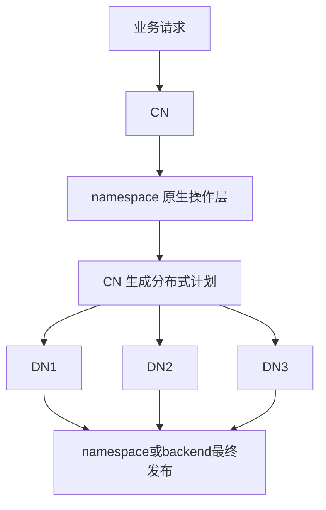
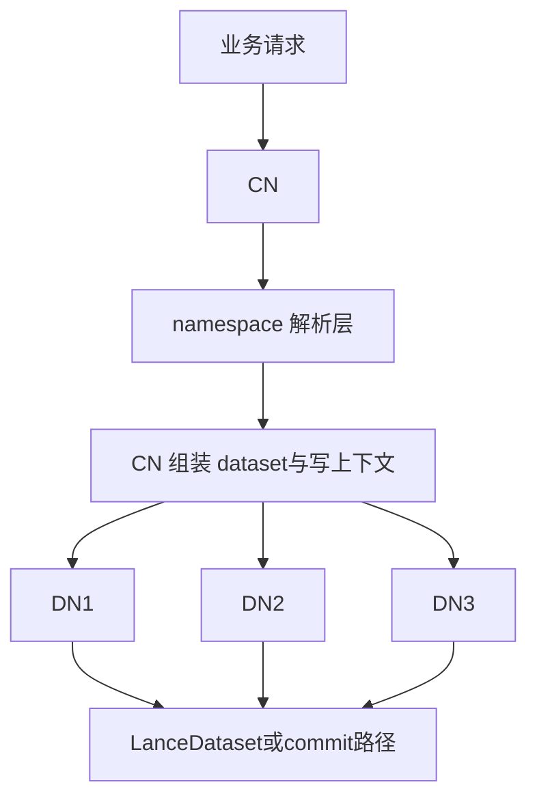

# namespace 原生 API vs 先打开 dataset 再走 Lance API

## 版本范围

- `pylance` / `lance`：`v6.0.0`
- `lance-namespace`：`v0.7.6`

---

## 1. 先给结论

在 Lance 里，把 `namespace` 接进来，大体有两种路线。

### 路线 A：namespace 原生 API

也就是操作入口直接是 namespace：

- `ns.create_table(...)`
- `ns.insert_into_table(...)`
- `ns.merge_insert_into_table(...)`
- `ns.update_table(...)`
- `ns.delete_from_table(...)`
- `ns.create_table_index(...)`

这条路的核心是：

> **namespace 自己就是操作入口。**

---

### 路线 B：先通过 namespace 打开 dataset，再走 Lance dataset API

也就是先：

```python
ds = lance.dataset(namespace_client=ns, table_id=table_id)
```

然后再：

- `ds.update(...)`
- `ds.delete(...)`
- `ds.merge_insert(...).execute(...)`
- `ds.create_index(...)`

或者低层一点：

- `describe_table(...)` / `declare_table(...)`
- `write_fragments(...)`
- `LanceDataset.commit(...)`

这条路的核心是：

> **namespace 先负责解析表和注入上下文，真正的操作语义还是以 LanceDataset 为中心。**

---

## 2. 第二种算不算接入 Lance Namespace？

**算，而且是很标准的一种。**

但它更准确的叫法不是“namespace-native mutation API integration”，而是：

- **namespace-aware integration**
- **namespace-resolved dataset integration**

也就是说：

- 你已经接入了 namespace
- 你已经让系统支持 `table_id -> location` 的解析
- 你已经让 `storage_options`、credential refresh、`managed_versioning` 这类上下文进入 Lance
- 只是你**没有把所有操作都改写成 namespace 原生 mutation API**

所以不要把“接入 namespace”和“所有操作都走 namespace 原生 API”混为一谈。

---

## 3. 两种路线的本质区别

## 3.1 谁是第一入口？

### 路线 A：namespace 原生 API

第一入口是 namespace。

你脑子里的模型是：

> 我对 `table_id` 发命令，namespace 自己处理这次操作。

---

### 路线 B：dataset API

第一入口是 `lance.dataset(...)` 或 Lance 的低层 commit 路径。

你脑子里的模型是：

> namespace 先帮我找到表、带上上下文；后面的操作继续按 Lance SDK 的方式做。

---

## 3.2 谁主导操作语义？

### 路线 A

主导操作语义的是 namespace。

比如：

- create / insert / merge / index 这类命令怎么表达
- 请求结构长什么样
- 响应里返什么字段
- 后端怎么 publish version
- REST header / request context 怎么下沉

它更像：

> **control plane / RPC API**

---

### 路线 B

主导操作语义的是 LanceDataset。

比如：

- `ds.update(...)`
- `ds.delete(...)`
- `ds.merge_insert(...)`
- `ds.create_index(...)`

namespace 在这里更像：

- 表定位器
- 存储参数提供方
- credential refresh 上下文提供方
- `managed_versioning` 策略提供方

它更像：

> **catalog + metadata + context injection layer**

---

## 3.3 对 backend 完整度的要求一样吗？

### 路线 A：要求更高

如果你想让所有操作都走 namespace 原生 API，那 backend 最好真的完整实现这些能力：

- `create_table`
- `insert_into_table`
- `merge_insert_into_table`
- `update_table`
- `delete_from_table`
- `create_table_index`

如果 backend 并没有把这些语义都兜完整，你就会卡住。

---

### 路线 B：要求更宽松

只要 namespace 能完成下面这些事，就已经很有价值：

- `table_id -> location`
- 返回 `storage_options`
- 返回 `managed_versioning`
- 提供 storage credential refresh 上下文

这时很多 mutation / index 操作仍然可以直接走 LanceDataset API。

---

## 3.4 工程改造成本一样吗？

### 路线 A：更重

因为你要把更多操作重构成：

- 面向 `table_id`
- 面向 namespace request/response
- 面向后端服务语义

这通常意味着你在做：

> **namespace-first 的控制面集成**

---

### 路线 B：更轻

因为很多现有数据平面逻辑不需要推翻。

如果你已经有：

- coordinator / CN
- worker / DN
- fragment 写入
- index segment 构建
- commit / publish

那你往往只需要：

1. CN 先通过 namespace resolve 表
2. 把 `location / storage_options / managed_versioning / read_version` 往下传
3. commit 时决定是否走 namespace managed versioning

这更像：

> **给已有分布式引擎加 namespace 感知**

而不是重写引擎。

---

## 4. 用单 CN / 多 DN 的视角看两条路线

下面这两张图，专门按“单 CN，多 DN”的分布式形态来画。

## 4.1 路线 A：namespace 原生 API



### 这张图真正表达的意思

这里不是说 DN 直接跟 namespace 对话，而是说：

- 这次操作的**第一入口和主语义**在 namespace 这一层
- CN 只是把 namespace 的命令转换成分布式执行计划
- 最终的 publish / metadata / version 语义更偏 namespace backend 自己消化

换句话说：

> **你是在做 namespace-native 的操作体系。**

---

## 4.2 路线 B：先打开 dataset，再走 Lance API



### 这张图真正表达的意思

这里 namespace 的主要职责是：

- 把 `table_id` 解析成真实表位置
- 提供 `storage_options`
- 提供 `managed_versioning`
- 为后续文件读写和 commit 提供上下文

真正的 mutation / index / commit 语义仍然落在 Lance 这一套上。

换句话说：

> **你是在做 namespace-aware 的 Lance 集成。**

---

## 5. 结合源码看，为什么第二种也算接入 namespace？

在 `v6.0.0` 的 Python 路径里：

### `lance.dataset(namespace_client=..., table_id=...)`

这条路并不是“完全无视 namespace”。

它会先通过 namespace 做：

- `DescribeTableRequest(id=table_id, version=version)`
- 从响应里拿：
  - `location`
  - `storage_options`
  - `managed_versioning`

然后再构造 `LanceDataset(...)`。

也就是说，这一步已经不是“纯 URI 打开表”了，而是：

> **先通过 namespace resolve，再得到 dataset。**

---

### `write_dataset(..., namespace_client=..., table_id=...)`

这条路也不是跳过 namespace。

它会根据模式先走：

- `declare_table(...)`，或者
- `describe_table(...)`

然后再把：

- `namespace_client`
- `table_id`
- `managed_versioning`

继续往下传到写入 / commit 路径。

所以这条路线在工程意义上已经是：

> **Lance SDK 与 namespace 联动执行**

不是“根本没接 namespace”。

---

## 6. 本项目的明确决策：全部走路线 B

这个仓库讨论的目标项目，已经明确选择：

> **全部走路线 B，也就是 namespace-aware / namespace-resolved dataset integration。**

这意味着：

- 接入 namespace，**但不把 namespace 原生 mutation API 作为主路线**
- namespace 的核心职责是：
  - 解析 `table_id`
  - 返回 `location`
  - 返回 `storage_options`
  - 返回 `managed_versioning`
  - 为后续读写 / commit 提供上下文
- 真正的数据操作仍然主要落在：
  - `lance.dataset(...)`
  - `write_dataset(...)`
  - `write_fragments(...)`
  - `LanceDataset.commit(...)`
  - `ds.update(...)`
  - `ds.delete(...)`
  - `ds.merge_insert(...)`
  - `ds.create_index(...)`

所以这里的目标不是：

> 把整个系统改造成 namespace-native 的操作协议层

而是：

> 给现有单 CN / 多 DN 分布式引擎加上 namespace 感知能力。

---

## 7. 在路线 B 下，CN 应该承担什么？

CN 是 namespace 集成的核心入口。

### 7.1 CN 的职责

CN 负责：

1. 接收业务层的 `table_id + operation`
2. 调用 namespace 做表解析：
   - `describe_table(...)`
   - `declare_table(...)`
3. 拿到并统一管理：
   - `table_uri` / `location`
   - `storage_options`
   - `managed_versioning`
   - 当前 `read_version`（如果操作需要）
4. 生成分布式执行计划
5. 把必要上下文下发给 DN
6. 收集 DN 产物
7. 走 Lance dataset / commit 路径做最终提交或发布

### 7.2 CN 不应该做什么？

在这条路线里，CN **不应该把主要操作语义重新包装成 namespace 原生 mutation API**。

也就是说，默认不要把主流程设计成：

- `ns.update_table(...)`
- `ns.delete_from_table(...)`
- `ns.create_table_index(...)`

除非后续你明确决定要演进到路线 A。

---

## 8. 在路线 B 下，DN 应该承担什么？

DN 继续做数据平面的工作，不把自己变成 namespace 操作入口。

### 8.1 DN 的职责

DN 负责：

- 接收 CN 下发的任务片段
- 使用 CN 下发的上下文执行具体工作
- 产出：
  - fragment
  - index segment
  - 中间统计信息
  - 必要的错误 / 进度回报

### 8.2 DN 不应该承担什么？

默认不让 DN 自己主导这些动作：

- 重新按 `table_id` 去 resolve 表
- 自己决定 `managed_versioning` 策略
- 自己独立做最终 publish / commit
- 把 mutation 主语义切到 namespace 原生 API

也就是说：

> **DN 吃的是 CN 下发的上下文，不是自己重新发明 namespace 接入逻辑。**

---

## 9. 路线 B 下建议统一传递的协议字段

为了让 CN / DN 边界清楚，建议至少把下面这些字段标准化。

### 9.1 必备字段

- `table_id`
- `table_uri`
- `storage_options`
- `managed_versioning`
- `operation`
- `request_id` / `job_id`

### 9.2 按需字段

- `read_version`
  - append / overwrite / update / delete / merge / index publish 常常会需要
- `branch`
- `version`
- `transaction_properties`
- `fragment_assignment`
- `index_assignment`
- `index_uuid`
- `fragment_ids`
- `write_mode`

### 9.3 一个很重要的原则

在路线 B 里：

> **`table_id` 是业务层标识，`table_uri` 是执行层标识。**

不要在执行中途把这两者混成一个概念。

更稳的做法是：

- 业务请求进来时只认 `table_id`
- CN resolve 后生成 `table_uri`
- DN 主要面向 `table_uri` 干活
- 最终 commit / publish 时由 CN 结合两者完成闭环

---

## 10. 各类操作在路线 B 下怎么落地？

## 10.1 read

推荐：

```python
ds = lance.dataset(namespace_client=ns, table_id=table_id)
```

语义：

- namespace 负责解析表
- LanceDataset 负责后续读路径

---

## 10.2 create / append / overwrite

推荐两种合法落地方式：

### 高层写路径

```python
lance.write_dataset(..., namespace_client=ns, table_id=table_id, mode="create")
```

或：

```python
lance.write_dataset(..., namespace_client=ns, table_id=table_id, mode="append")
```

### 低层分布式写路径

- CN：`declare_table(...)` / `describe_table(...)`
- DN：`write_fragments(...)`
- CN：`LanceDataset.commit(...)`

如果你已有单 CN / 多 DN 的写框架，通常第二条更贴近真实落地。

---

## 10.3 update / delete / merge

默认推荐：

```python
ds = lance.dataset(namespace_client=ns, table_id=table_id)
ds.update(...)
ds.delete(...)
ds.merge_insert(...).execute(...)
```

原因是：

- 这条路跟 Lance SDK 现有语义最一致
- 不依赖 namespace backend 必须完整实现原生 mutation API
- 更适合先把 namespace 接进已有系统

---

## 10.4 index

默认推荐：

```python
ds = lance.dataset(namespace_client=ns, table_id=table_id)
ds.create_index(...)
```

如果是分布式 index：

- DN 负责 segment 构建
- CN 负责合并与最终发布
- namespace 继续只负责前置 resolve 和上下文注入

---

## 11. 为什么这个项目不把路线 A 作为主路线？

原因不是路线 A 不对，而是它**不适合当前阶段的工程目标**。

### 11.1 当前目标

当前目标是：

- 保住现有单 CN / 多 DN 结构
- 尽快接入 namespace
- 让 read / write / update / delete / merge / index 都能带 namespace 上下文
- 接入 `managed_versioning`
- 降低对 namespace backend mutation 完整度的依赖

### 11.2 路线 A 的额外成本

如果把路线 A 作为主路线，你通常还要额外承担：

- namespace 原生 mutation 协议设计
- 更完整的 backend API 实现
- 更复杂的 request / response 语义统一
- control-plane 与 data-plane 的重新分层
- 更多兼容和测试成本

这不是不能做，而是：

> **这已经不是“给现有系统接 namespace”，而是在重塑操作协议层。**

---

## 12. 最后一句话总结

对这个项目来说：

> **namespace 是前置解析层和上下文注入层，不是主操作入口。**

更具体一点：

- **CN 负责 namespace resolve 与最终提交闭环**
- **DN 负责数据平面执行**
- **create / read / write / update / delete / merge / index 全部优先走路线 B**

所以最终定性就是：

> **这是一个“全量路线 B”的 Lance Namespace 接入方案。**

---

## 13. 相关文档

- `docs/namespace-read-write-fragments.md`
  - 讲 read / write_fragments / commit 冲突
- `docs/managed-versioning-how-it-works.md`
  - 讲 `managed_versioning` 生效条件与传递链路
- `docs/namespace-create-update-index.md`
  - 讲 create / update / index 的接法与推荐路线
