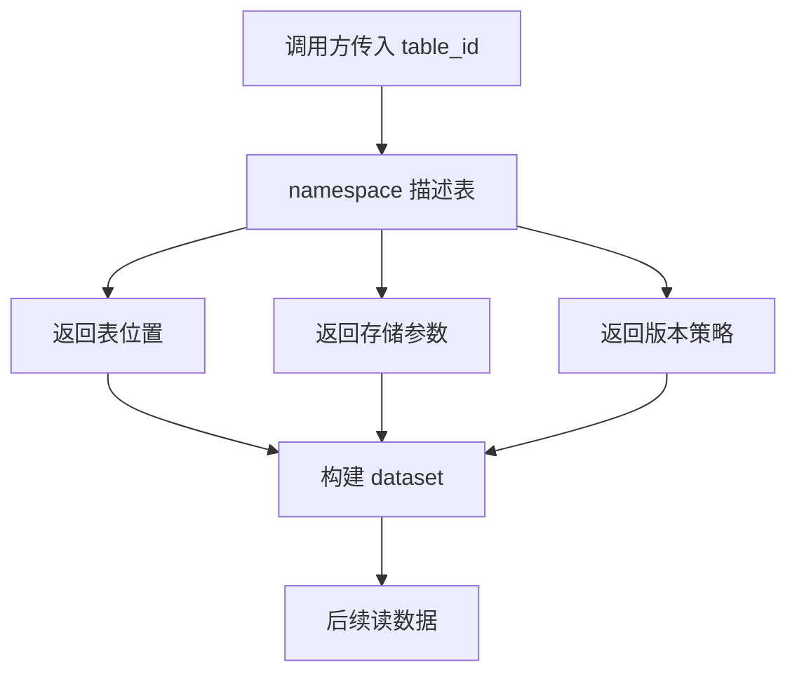
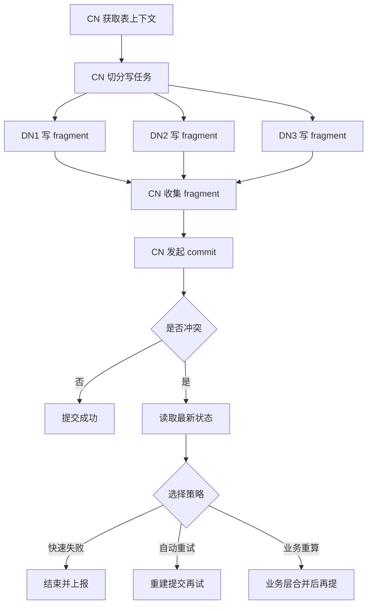

# Lance Namespace 在读表、分布式写和 Commit 冲突中的作用

## 版本范围

- `pylance` / `lance`：`v6.0.0`
- `lance-namespace`：`v0.7.6`

---

## 1. 先直接回答：commit 的时候冲突是由 namespace 处理的吗？

**答案：不是一刀切地“都由 namespace 处理”，而是要看 `managed_versioning`。**

更准确地说：

### 情况 A：`managed_versioning=True`

这时 `namespace` 不只是“找表”和“发 credential”。

它还会接管 **表版本发布** 这件事。也就是说，commit 到最后真正“把新版本登记为最新版本”的阶段，会走 namespace 的 table version API。

这时 commit 冲突的核心语义更接近：

- 目标版本是否已经存在
- 当前要发布的 manifest 是否还能合法注册成这个版本
- 并发版本发布是否发生冲突

如果冲突，namespace 会返回冲突错误，Lance 再把这个冲突向上抛出。

### 情况 B：`managed_versioning` 没开或为 `False`

这时 `namespace` 不负责版本发布。

commit 冲突还是走 Lance 原生的提交层：

- manifest 发布
- 版本号推进
- 原生 commit handler / object store / 外部提交后端

所以这里的关键判断不是“有没有传 `namespace_client`”，而是：

> **namespace 是否明确声明自己管理 table version。**

---

## 2. 这件事在源码里是怎么落下来的

### 2.1 读表入口会先问 namespace

当你走：

```python
lance.dataset(namespace_client=ns, table_id=table_id)
```

内部会先做 `describe_table(...)`，拿到：

- `location`
- `storage_options`
- `managed_versioning`

然后再构建 dataset。

如果 `managed_versioning=True`，Rust 侧会给这个 dataset builder 安装 **external manifest commit handler**，也就是后续版本管理会走 namespace 对应的 external manifest store 语义。

---

### 2.2 `managed_versioning=True` 时，读和写都会改走 namespace 版本接口

从上游测试能直接看到这件事：

- 打开 latest version 时，会调用 `list_table_versions`
- 打开指定 version 时，会调用 `describe_table_version`
- create / append 提交时，会调用 `create_table_version`

这说明：

> 只要 namespace 宣告自己管理版本，Lance 就不再单纯依赖原生的本地 version 发现逻辑，而是把“版本视图”交给 namespace。

---

### 2.3 `create_table_version` 冲突会直接失败

上游 `DirectoryNamespace` 的测试里有明确语义：

- 同一个版本第一次 `create_table_version` 成功
- 第二次再创建同一个版本会失败

这说明 namespace 在 managed versioning 模式下，确实承担了 **版本发布冲突检测**。

但注意：

> 它检测的是“版本发布冲突”，不是“业务数据自动合并”。

---

## 3. 读表时，namespace 到底做了什么

## 3.1 读路径角色

在读路径里，`namespace` 的角色很明确：

1. **表定位器**
   - `table_id -> table_uri / location`
2. **存储参数提供者**
   - 返回 `storage_options`
3. **版本策略提供者**
   - 通过 `managed_versioning` 告诉 Lance：版本查询和版本提交是否要走 namespace
4. **动态 credential 刷新入口**
   - 如果 namespace 下发的是临时凭证，后续可以继续通过 provider 刷新

---

## 3.2 读路径图



---

## 4. `write_dataset` 和 `write_fragments` 的本质区别

这个区别很关键。

### 4.1 `write_dataset(...)`

这是高层封装。

如果你给的是：

- `namespace_client`
- `table_id`

它可以自己去做：

- `declare_table(...)` 或 `describe_table(...)`
- 自动拿 `location`
- 自动处理一部分 namespace 对接逻辑

所以它更像：

> **带 namespace 感知的高层写入口**

---

### 4.2 `write_fragments(...)`

这是低层接口。

它虽然也接收：

- `namespace_client`
- `table_id`

但这俩参数 **不足以单独完成表定位**。

你还是得先准备好真实的 `table_uri`。

所以它更像：

> **分布式写协议里的“生成 fragment”阶段接口**

---

## 5. 你问的 1：哪些冲突它能检测出来？

这里的“它”，要拆成两层：

- Lance commit 层
- namespace version 层

### 5.1 能检测的冲突

#### 一类：基于旧版本提交

如果一个写任务基于旧快照 / 旧版本做提交，而期间已经有别的提交成功推进了版本，那么后来的提交会变成 stale commit。

这类冲突系统是能检测的。

典型表现是：

- 读到的版本已经落后
- 目标版本号已被占用
- commit 时发现版本不匹配

---

#### 二类：同一个新版本被重复发布

当 `managed_versioning=True` 时，namespace 的 `create_table_version` 会检查目标版本是否已经存在。

如果版本已经存在，再创建一次就会失败。

这本质上是：

> **版本发布冲突检测**

---

#### 三类：并发提交导致的 manifest 发布冲突

不管是原生 Lance 提交层，还是 namespace 管理的 external manifest 路径，最终都要把一个新 manifest 作为“新版本”发布出去。

只要两个提交试图竞争同一个版本推进点，就会发生冲突检测。

---

#### 四类：乐观并发控制相关冲突

namespace 的 table version 模型里包含 `e_tag` 等字段，用于 optimistic concurrency control。

所以在支持这套语义的后端里，冲突可以细化到：

- 当前对象是否还是你以为的那个对象
- 发布期间底层对象是否已经变化

---

## 6. 你问的 2：哪些冲突它不会自动帮你解决？

这个地方最容易误解。

### 6.1 业务语义冲突

例如：

- 两个作业同时写同一批业务主键
- 两个作业都在更新同一批 row
- 一个作业 append，另一个作业 overwrite
- 两个作业都认为自己应该成为“最新正确结果”

这种冲突，Lance / namespace **不会自动替你做业务判定**。

它不会知道：

- 谁应该赢
- 需不需要 merge
- 需不需要去重
- 哪些行应该覆盖哪些行

---

### 6.2 分片重复写

如果多个 DN 因为调度问题写了重复的数据分片，只要这些 fragment 在物理上是合法的，commit 层不一定知道这是“业务上的重复”。

它只负责：

- 文件和 manifest 是否有效
- 版本提交是否合法

它不负责：

- 你的数据是不是重复了

---

### 6.3 幂等和重试语义

如果 worker 重试导致重复生成 fragment，或者 coordinator 在未知提交状态下重复发起 commit，系统只能帮你检测一部分版本冲突。

但更高层的：

- 请求去重
- task id 幂等
- 结果回收
- orphan fragment 清理

仍然要你在业务层设计。

---

## 7. 你问的 3：CN / DN 模式下推荐怎么处理冲突？

## 7.1 推荐心智模型

把这套东西理解成：

- **DN 负责产出 fragment 文件**
- **CN 负责收口成一个新版本**
- **冲突主要收敛到 CN commit 这一跳**

这就是它的价值。

它不是让所有节点都直接改同一份版本元数据，而是把最终冲突集中到一个提交点。

---

## 7.2 推荐流程

### 第一步：CN 先拿表上下文

CN 通过 `declare_table(...)` 或 `describe_table(...)` 获取：

- `table_uri`
- `storage_options`
- `managed_versioning`
- 当前版本视图（如果你的业务需要）

---

### 第二步：CN 切分任务给 DN

CN 把这些信息下发给 DN：

- `table_uri`
- `table_id`
- 必要的 `storage_options`
- 本次写入任务标识

注意：

> DN 不应该自己再去猜表位置。

CN 先解析清楚，再统一下发，最稳。

---

### 第三步：DN 只写 fragment，不碰最终提交

DN 执行：

- `write_fragments(...)`

然后把产物返回给 CN。

这样 DN 与 DN 之间通常不会在版本元数据层面直接打架。

---

### 第四步：CN 统一 commit

CN 收集所有 fragment 后，构造：

- `Append`
- `Overwrite`
- 或事务对象

然后统一 `commit`。

这一步才是真正可能发生版本冲突的地方。

---

### 第五步：commit 冲突处理策略

推荐这样处理：

#### 策略 A：fail fast

适合：

- 强一致任务
- 不希望自动重放
- 业务上需要人工判断冲突

做法：

- 冲突直接失败
- 重新读最新状态
- 人或上层调度器决定是否重做

#### 策略 B：自动重试

适合：

- append 型任务
- 业务幂等性较强
- 允许短时间竞争

做法：

- 重新拿最新版本视图
- 必要时重新生成 operation
- 再 commit 一次

#### 策略 C：业务层 rebase

适合：

- 有主键语义
- 有 merge 规则
- overwrite / upsert 语义复杂

做法：

- 先读最新数据
- 在业务层决定怎样合并
- 重新生成 fragment / transaction
- 再提交

---

## 7.3 推荐流程图



---

## 8. `examples/distributed_write_with_namespace.py` 应该怎么理解

这个例子不是“真实多机系统”，但它在语义上就是：

- **CN**：
  - `declare_table(...)`
  - 解析 `table_uri`
  - 收集 fragment
  - 最后 `commit`
- **DN**：
  - `write_fragments(...)`

所以如果你脑子里想的是：

> 一个 CN 负责规划，多个 DN 负责写，最后 CN 提交

那这个例子就是在**简化模拟这个协议**，你的理解没跑偏。

---

## 9. 为什么之前的 Mermaid 在 GitHub 没渲染出来

大概率不是 Mermaid 块本身没包对，而是 **节点文本太复杂**。

GitHub 的 Mermaid 渲染经常对这些内容更敏感：

- 太长的函数签名
- 节点里塞很多括号和逗号
- 节点里混很多斜杠、下划线、引号
- 一行里塞太多说明文字

所以这次我做了这些调整：

1. 节点文本改短
2. 节点里不用完整函数签名
3. 复杂解释移到图外正文
4. 图里只保留流程骨架

这样在 GitHub 上一般更稳。

---

## 10. 相关源码定位

下面这些文件是这次结论最关键的依据：

- `/root/.openclaw/workspace/_lance_src_v6.0.0/python/python/lance/__init__.py`
  - `lance.dataset(...)` 通过 `describe_table(...)` 解析 `location`、`storage_options`、`managed_versioning`
- `/root/.openclaw/workspace/_lance_src_v6.0.0/python/python/lance/dataset.py`
  - `LanceDataset.commit(...)` 把 `namespace_client`、`table_id`、`namespace_client_managed_versioning` 继续传下去
  - 非 `Overwrite` / `Restore` 操作要求 `read_version`
- `/root/.openclaw/workspace/_lance_src_v6.0.0/python/python/lance/fragment.py`
  - `write_fragments(...)` 仍要求显式给出 `dataset_uri` / `table_uri`
- `/root/.openclaw/workspace/_lance_src_v6.0.0/python/python/tests/test_namespace_integration.py`
  - 上游分布式写测试模式：`declare_table -> write_fragments x N -> commit`
- `/root/.openclaw/workspace/_lance_src_v6.0.0/python/python/tests/test_namespace_dir.py`
  - `managed_versioning=True` 时，读 latest 会走 `list_table_versions`
  - 读指定 version 会走 `describe_table_version`
  - create / append 提交会走 `create_table_version`
- `/root/.openclaw/workspace/_lance_src_v6.0.0/rust/lance/src/dataset/builder.rs`
  - 读表时根据 `managed_versioning` 安装 external manifest commit handler
- `/root/.openclaw/workspace/_lance_src_v6.0.0/rust/lance-namespace/src/namespace.rs`
  - `create_table_version(...)` / `describe_table_version(...)` / `list_table_versions(...)` 的抽象接口定义
- `/root/.openclaw/workspace/_lance_src_v6.0.0/rust/lance-namespace-impls/src/dir.rs`
  - `DirectoryNamespace` 的 managed versioning 实现与冲突测试
- `/root/.openclaw/workspace/_lance_src_v6.0.0/rust/lance-core/src/error.rs`
  - `Commit conflict for version ...` 错误语义
- `/root/.openclaw/workspace/_lance_namespace_src_v0.7.6/python/lance_namespace/lance_namespace/errors.py`
  - `CONCURRENT_MODIFICATION` 等 namespace 错误码

---

## 11. 最后压一句结论

### 关于“commit 冲突是不是由 namespace 处理”

最准确的一句话是：

> **当 `managed_versioning=True` 时，commit 阶段的版本发布冲突主要由 namespace 版本接口处理；当它没开时，冲突仍由 Lance 原生提交层处理。**

### 关于 `write_fragments(...)`

最准确的一句话是：

> **它是更接近分布式写协议的低层接口，不负责自动找表，负责的是在明确 `table_uri` 之后产出 fragment，并把最终冲突收敛到 CN commit。**