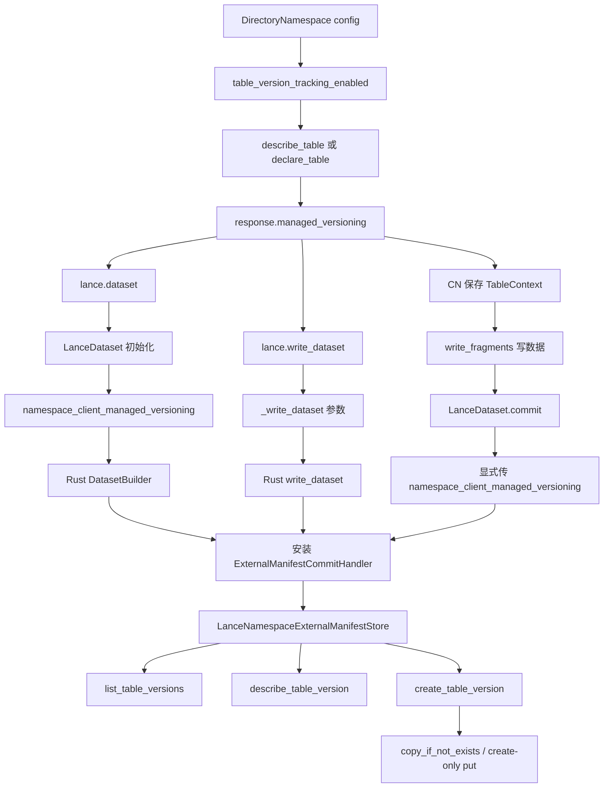

# 为什么 managed_versioning 看起来要传三次

## 版本范围

- `pylance` / `lance`：`v6.0.0`
- `lance-namespace`：`v0.7.6`

---

## 1. 问题

接入 Lance namespace-managed versioning 时，表面上会看到三个很像的开关：

1. 创建 namespace 时配置：

   ```python
   ns = lance.namespace.DirectoryNamespace(
       root=root,
       table_version_tracking_enabled="true",
       manifest_enabled="true",
   )
   ```

2. 打开 / 初始化 dataset 时，内部会带上：

   ```python
   namespace_client_managed_versioning=True
   ```

3. 低层 commit 时又要显式传：

   ```python
   lance.LanceDataset.commit(
       table_uri,
       op,
       read_version=base.version,
       namespace_client=ns,
       table_id=table_id,
       namespace_client_managed_versioning=managed,
   )
   ```

直觉上会觉得奇怪：

> 明明 namespace config 已经开了，为什么 dataset 初始化要带一次，commit 又要带一次？是不是重复设计？

结论先说：

> **这不是三个独立开关，而是同一个能力信号在三层边界上的显式传递。**
>
> 第一层是 namespace 后端能力声明；第二层是 Python / Dataset runtime 保存这个声明；第三层是 advanced commit API 决定本次提交是否安装 namespace-backed external manifest commit handler。

---

## 2. 三个位置分别代表什么

### 2.1 `table_version_tracking_enabled`：namespace 后端能力开关

`table_version_tracking_enabled` 是 `DirectoryNamespace` 的后端配置。

源码里默认是 `false`：

```rust
// rust/lance-namespace-impls/src/dir.rs
// Extract table_version_tracking_enabled (default: false)
let table_version_tracking_enabled = properties
    .get("table_version_tracking_enabled")
    .and_then(|v| v.parse::<bool>().ok())
    .unwrap_or(false);
```

对应源码：`../_lance_src_v6.0.0/rust/lance-namespace-impls/src/dir.rs:455-459`

当它为 `true` 时，`DirectoryNamespace` 在 `describe_table(...)` 或 `declare_table(...)` 响应里返回：

```rust
managed_versioning: if self.table_version_tracking_enabled {
    Some(true)
} else {
    None
},
```

对应源码：

- `../_lance_src_v6.0.0/rust/lance-namespace-impls/src/dir.rs:1285-1288`
- `../_lance_src_v6.0.0/rust/lance-namespace-impls/src/dir.rs:1352-1356`
- `../_lance_src_v6.0.0/rust/lance-namespace-impls/src/dir.rs:2610-2613`

所以这一层回答的是：

> **这个 namespace backend 是否声明：表版本发布由 namespace 管？**

它是服务端 / 后端能力，不是某一次 Python commit 的本地开关。

对 `RestNamespace` 来说更明显：客户端本地不能靠构造参数强行打开 managed versioning，最终取决于远端 namespace service 在 `describe_table / declare_table` 里是否返回 `managed_versioning=True`。

---

### 2.2 response 里的 `managed_versioning`：表级能力信号

`managed_versioning` 最早不是用户传给 Lance 的参数，而是 namespace response 的字段。

读表时，Python `lance.dataset(...)` 会先问 namespace：

```python
request = DescribeTableRequest(id=table_id, version=version)
response = namespace_client.describe_table(request)

uri = response.location
namespace_client_managed_versioning = (
    getattr(response, "managed_versioning", None) is True
)
```

然后把这个布尔值传入 `LanceDataset(...)`：

```python
LanceDataset(
    uri,
    version,
    ...,
    namespace_client=namespace_client,
    table_id=table_id,
    namespace_client_managed_versioning=namespace_client_managed_versioning,
)
```

对应源码：`../_lance_src_v6.0.0/python/python/lance/__init__.py:211-253`

高层写入 `lance.write_dataset(...)` 也类似：

```python
if mode == "create":
    response = namespace_client.declare_table(...)
elif mode in ("append", "overwrite"):
    response = namespace_client.describe_table(...)

namespace_client_managed_versioning = (
    getattr(response, "managed_versioning", None) is True
)

params["namespace_client_managed_versioning"] = namespace_client_managed_versioning
```

对应源码：`../_lance_src_v6.0.0/python/python/lance/dataset.py:6595-6684`

所以这一层回答的是：

> **当前这个 table，在 namespace 解析之后，是否应该走 namespace-managed versioning？**

注意：它是从 namespace response 派生出来的能力信号，正常不应该由业务代码拍脑袋写死。

推荐写法是：

```python
resp = ns.describe_table(DescribeTableRequest(id=table_id))
managed = resp.managed_versioning is True
```

然后把 `managed` 作为上下文继续传下去。

---

### 2.3 `namespace_client_managed_versioning`：Lance runtime / commit handler 执行开关

Python `LanceDataset.__init__` 会保存这个状态：

```python
self._namespace_client = namespace_client
self._table_id = table_id
self._namespace_client_managed_versioning = namespace_client_managed_versioning
```

并继续传给 Rust `_Dataset(...)`：

```python
self._ds = _Dataset(
    uri,
    ...,
    namespace_client=namespace_client,
    table_id=table_id,
    namespace_client_managed_versioning=namespace_client_managed_versioning,
)
```

对应源码：`../_lance_src_v6.0.0/python/python/lance/dataset.py:602-625`

Rust `_Dataset` 打开时，如果这个值为真，会安装 namespace-backed external manifest handler：

```rust
// Set up commit handler only if namespace manages versioning
if namespace_client_managed_versioning {
    let external_store =
        LanceNamespaceExternalManifestStore::new(ns_client, tid.clone());
    let commit_handler: Arc<dyn CommitHandler> =
        Arc::new(ExternalManifestCommitHandler {
            external_manifest_store: Arc::new(external_store),
        });
    builder = builder.with_commit_handler(commit_handler);
}
```

对应源码：`../_lance_src_v6.0.0/python/src/dataset.rs:795-804`

低层 `LanceDataset.commit(...)` 也是同样逻辑，不过它是 advanced static API，所以参数默认是 `False`：

```python
namespace_client_managed_versioning: bool = False
```

对应源码：`../_lance_src_v6.0.0/python/python/lance/dataset.py:3958-3966`

然后 Python 只负责原样传到 Rust：

```python
_Dataset.commit(
    ...,
    namespace_client=namespace_client,
    table_id=table_id,
    namespace_client_managed_versioning=namespace_client_managed_versioning,
)
```

对应源码：`../_lance_src_v6.0.0/python/python/lance/dataset.py:4119-4134`

Rust commit 侧会按这个条件安装 handler：

```rust
if namespace_client_managed_versioning
    && let (Some(ns_client), Some(tid)) = (namespace_client, table_id)
{
    let external_store = LanceNamespaceExternalManifestStore::new(ns_client, tid);
    Some(Arc::new(ExternalManifestCommitHandler {
        external_manifest_store: Arc::new(external_store),
    }) as Arc<dyn CommitHandler>)
} else {
    None
}
```

对应源码：`../_lance_src_v6.0.0/python/src/dataset.rs:2590-2612`

所以这一层回答的是：

> **本次 dataset open / commit，是否真的切换到 namespace external manifest store？**

这一步不传，就不会装 `ExternalManifestCommitHandler`，即使你传了 `namespace_client` 和 `table_id`。

---

## 3. 真正生效的是 `ExternalManifestCommitHandler`

`namespace_client_managed_versioning=True` 的核心效果，不是“告诉 Lance 这个表在哪”，而是安装：

```text
ExternalManifestCommitHandler
  -> LanceNamespaceExternalManifestStore
      -> namespace.create_table_version(...)
      -> namespace.describe_table_version(...)
      -> namespace.list_table_versions(...)
```

`LanceNamespaceExternalManifestStore` 的源码非常直观：

```rust
async fn get(&self, _base_uri: &str, version: u64) -> Result<String> {
    let request = DescribeTableVersionRequest {
        id: Some(self.table_id.clone()),
        version: Some(version as i64),
        ..Default::default()
    };
    let response = self.namespace_client.describe_table_version(request).await?;
    Ok(response.version.manifest_path)
}

async fn get_latest_version(&self, _base_uri: &str) -> Result<Option<(u64, String)>> {
    let request = ListTableVersionsRequest {
        id: Some(self.table_id.clone()),
        descending: Some(true),
        limit: Some(1),
        ..Default::default()
    };
    let response = self.namespace_client.list_table_versions(request).await?;
    ...
}

async fn put(..., version: u64, staging_path: &Path, ...) -> Result<ManifestLocation> {
    let request = CreateTableVersionRequest {
        id: Some(self.table_id.clone()),
        version: version as i64,
        manifest_path: staging_path.to_string(),
        ...
    };
    let response = self.namespace_client.create_table_version(request).await?;
    ...
}
```

对应源码：`../_lance_src_v6.0.0/rust/lance/src/io/commit/namespace_manifest.rs:25-105`

这说明 namespace-managed versioning 的本质是：

> **把“manifest version 发布”这一步从 Lance 直接写 object store，切换成调用 namespace 的 table version API。**

`DirectoryNamespace.create_table_version(...)` 里会把 staging manifest 复制成最终 manifest，并用 `copy_if_not_exists` / `PutMode::Create` 获得“同一个 target version 只能创建一次”的冲突检测：

```rust
self.object_store.inner.copy_if_not_exists(&staging_path, &final_path).await
```

fallback 时也用 create-only put：

```rust
put_opts(..., PutOptions { mode: PutMode::Create, ..Default::default() })
```

如果目标版本已存在，返回 concurrent modification：

```rust
NamespaceError::ConcurrentModification {
    message: format!(
        "Version {} already exists for table at '{}'",
        version, table_uri
    ),
}
```

对应源码：`../_lance_src_v6.0.0/rust/lance-namespace-impls/src/dir.rs:2791-2863`

所以低层 commit 时的 `namespace_client_managed_versioning` 是关键执行点：

- `False`：commit 不走 namespace table version API
- `True`：commit 走 `create_table_version / list_table_versions / describe_table_version`

---

## 4. 为什么 commit 不自动重新问 namespace？

这是最容易误解的地方。

### 4.1 `LanceDataset.commit(...)` 是 advanced static API

官方 docstring 已经说它是 advanced API，主要服务于分布式场景：

```python
This method is an advanced method ...
It's current purpose is to allow for changes being made in a distributed environment
where no single process is doing all of the work.
```

对应源码：`../_lance_src_v6.0.0/python/python/lance/dataset.py:3968-3986`

这个 API 可以这样调用：

```python
LanceDataset.commit(table_uri, op, read_version=1)
```

也可以这样调用：

```python
LanceDataset.commit(dataset_obj, op, read_version=1)
```

也就是说，它不一定经过 `lance.dataset(namespace_client=..., table_id=...)` 这个解析路径。

源码里如果 `base_uri` 是 `LanceDataset`，也只是取底层 `_ds`：

```python
elif isinstance(base_uri, LanceDataset):
    base_uri = base_uri._ds
```

对应源码：`../_lance_src_v6.0.0/python/python/lance/dataset.py:4070-4073`

它没有自动读取 Python 对象上的：

```python
base_uri._namespace_client_managed_versioning
```

所以就算你前面打开过一个 namespace-aware dataset，只要你后面走 static `LanceDataset.commit(...)`，也不能假设这个状态会自动继承。

---

### 4.2 commit handler 有显式优先级

Rust commit 侧有优先级：

1. 如果用户显式给了 `commit_lock`，优先使用用户的 commit handler
2. 否则如果 `namespace_client_managed_versioning=True` 且同时有 `namespace_client + table_id`，才安装 `ExternalManifestCommitHandler`
3. 否则不安装 namespace external manifest handler

源码注释也这么写：

```rust
// Create commit_handler: prefer user-provided commit_lock, then namespace client-based handler
// (only if namespace_client_managed_versioning is true)
```

对应源码：`../_lance_src_v6.0.0/python/src/dataset.rs:2590-2604`

这说明 Lance 不想隐式覆盖用户自定义 commit handler。

如果 commit 层自动重新问 namespace 并偷偷安装 handler，就可能和用户传入的 commit lock / commit handler 语义冲突。

---

### 4.3 避免隐式网络调用和状态漂移

对 `RestNamespace` 来说，重新问 namespace 可能是一次远程 RPC。

低层 commit 之所以让调用方显式传 `namespace_client_managed_versioning`，本质上是在要求调用方声明：

> “我已经在提交协议的上游解析过 namespace，并且确认这个表要走 namespace-managed versioning。”

这对 CN/DN 分布式写尤其重要。

典型流程应该是：

```python
# CN: resolve table context
resp = ns.describe_table(DescribeTableRequest(id=table_id))
ctx = {
    "table_uri": resp.location,
    "storage_options": dict(resp.storage_options or {}),
    "managed_versioning": resp.managed_versioning is True,
    "read_version": lance.dataset(namespace_client=ns, table_id=table_id).version,
}

# DN: write fragments，只需要 table_uri + storage_options
frags = write_fragments(table, ctx["table_uri"], storage_options=ctx["storage_options"])

# CN: final commit，显式使用 ctx 里的 managed_versioning
new_ds = lance.LanceDataset.commit(
    ctx["table_uri"],
    lance.LanceOperation.Append(frags),
    read_version=ctx["read_version"],
    storage_options=ctx["storage_options"],
    namespace_client=ns,
    table_id=table_id,
    namespace_client_managed_versioning=ctx["managed_versioning"],
)
```

这里的显式字段虽然啰嗦，但能让分布式协议边界清楚：

- `table_uri`：数据写到哪里
- `storage_options`：怎么访问对象存储
- `read_version`：基于哪个版本规划
- `managed_versioning`：最终 manifest publish 交给谁

---

## 5. 哪些路径会自动透传，哪些路径必须手动传

### 5.1 自动透传：`lance.dataset(...)`

```python
ds = lance.dataset(namespace_client=ns, table_id=table_id)
```

内部会：

1. `describe_table(...)`
2. 读取 `managed_versioning`
3. 构造 `LanceDataset(..., namespace_client_managed_versioning=...)`
4. Rust dataset builder 安装 namespace external manifest handler

适合读路径，以及后续直接使用 dataset 对象上的高层方法。

---

### 5.2 自动透传：`lance.write_dataset(...)`

```python
lance.write_dataset(table, namespace_client=ns, table_id=table_id, mode="append")
```

内部会：

1. `mode=create` 时调用 `declare_table(...)`
2. `mode=append/overwrite` 时调用 `describe_table(...)`
3. 读取 `managed_versioning`
4. 放入 `_write_dataset(...)` 参数
5. Rust 写入路径根据该参数安装 handler

对应源码：

- Python 参数组装：`../_lance_src_v6.0.0/python/python/lance/dataset.py:6595-6684`
- Rust `_write_dataset` handler 安装：`../_lance_src_v6.0.0/python/src/dataset.rs:3846-3860`

所以走高层 `write_dataset(...)` 时，一般不需要业务代码手动传 `namespace_client_managed_versioning`。

---

### 5.3 必须手动透传：`write_fragments(...) + LanceDataset.commit(...)`

```python
frags = write_fragments(...)
new_ds = LanceDataset.commit(
    table_uri,
    LanceOperation.Append(frags),
    read_version=base.version,
    namespace_client=ns,
    table_id=table_id,
    namespace_client_managed_versioning=managed,
)
```

原因是：

- `write_fragments(...)` 只写数据文件 / fragments，不发布新版本
- `LanceDataset.commit(...)` 是 advanced static API，不保证继承任何 dataset object 的 namespace 状态
- commit 层不会自动 `describe_table(...)` 再问一遍
- 是否安装 `ExternalManifestCommitHandler` 只看本次 commit 参数

这一条正是 CN/DN lakehouse 场景最容易踩坑的路径。

---

## 6. 传错会怎样

### 6.1 namespace 后端没开，但 commit 强行传 `True`

如果 `DirectoryNamespace` 没开 `table_version_tracking_enabled`，通常 `describe_table(...)` 不会返回 `managed_versioning=True`。

如果业务代码不从 response 取值，而是强行写：

```python
namespace_client_managed_versioning=True
```

那 Rust commit 会尝试安装 `ExternalManifestCommitHandler`，进而调用：

- `list_table_versions`
- `describe_table_version`
- `create_table_version`

这要求 namespace backend 支持 table version API。对 `DirectoryNamespace` 可能仍然有实现，但语义上已经和服务端声明不一致；对某些 namespace 实现，则可能直接 `not supported`。

可以把它理解成下面两条分叉路径：

```mermaid
flowchart LR
    subgraph A[正常路径: tracking=false, commit 也传 false]
        A1[connect / describe_table]
        A2[managed_versioning = None or False]
        A3[write_fragments / prepare op]
        A4[LanceDataset.commit(..., namespace_client_managed_versioning=False)]
        A5[普通 Lance commit]
        A6[直接发布 object store manifest]
        A1 --> A2 --> A3 --> A4 --> A5 --> A6
    end

    subgraph B[异常路径: tracking=false, 但 commit 强行传 true]
        B1[connect / describe_table]
        B2[managed_versioning = None or False]
        B3[write_fragments / prepare op]
        B4[LanceDataset.commit(..., namespace_client_managed_versioning=True)]
        B5[安装 ExternalManifestCommitHandler]
        B6[调用 list/describe/create_table_version]
        B7a[DirectoryNamespace: 可能能跑, 但语义与声明不一致]
        B7b[其他 backend: 可能直接 not supported]
        B1 --> B2 --> B3 --> B4 --> B5 --> B6
        B6 --> B7a
        B6 --> B7b
    end
```

这里最容易误解的点是：

> `table_version_tracking_enabled=false` 不是一个 commit 时的硬拦截器，  
> 它更像 namespace 对外声明的 capability。  
> 而 `namespace_client_managed_versioning=True` 是你在单次 commit 上手动绕过这份声明。

所以在官方 Python 库里，这种“前面 response 说没开，后面 commit 还硬传 `True`”的行为不会被自动纠正；Lance 会真的走 namespace-managed commit 路径。

所以不要把它当成本地 override。正确做法是：

```python
managed = resp.managed_versioning is True
```

---

### 6.2 namespace 后端开了，但 commit 忘了传 `True`

这是更危险、更常见的情况。

你可能已经：

```python
ns = DirectoryNamespace(..., table_version_tracking_enabled="true")
base = lance.dataset(namespace_client=ns, table_id=table_id)
```

但低层 commit 时写成：

```python
LanceDataset.commit(
    table_uri,
    op,
    read_version=base.version,
    namespace_client=ns,
    table_id=table_id,
    # 忘了 namespace_client_managed_versioning=managed
)
```

因为默认值是 `False`，Rust 不会安装 `ExternalManifestCommitHandler`。

后果是：

- 本次 commit 不通过 namespace `create_table_version(...)` 发布版本
- namespace table version API 的冲突检测 / 版本登记不参与
- 你以为自己在走 namespace-managed commit，实际上回退到了普通 Lance commit 路径

这就是为什么低层路径里必须显式透传。

---

### 6.3 只传 `namespace_client + table_id`，但不传 managed flag

不够。

Rust 条件是：

```rust
namespace_client_managed_versioning
    && let (Some(ns_client), Some(tid)) = (namespace_client, table_id)
```

也就是说三个条件缺一不可：

1. `namespace_client_managed_versioning=True`
2. `namespace_client` 存在
3. `table_id` 存在

只给 namespace client 和 table id，最多能支持 credential refresh / storage options provider 这一类上下文，不代表 commit 一定切换到 namespace-managed versioning。

---

## 7. 这套设计为什么不是一个全局开关

从工程边界看，Lance 这里把一个概念拆成三层，有几个现实原因。

### 7.1 namespace backend 和 Lance client 解耦

`DirectoryNamespace` 只是一个 backend 实现；`RestNamespace` 背后可能是独立服务。

客户端不应该本地说：

> “我想 managed，所以服务端就必须 managed。”

正确方向应该是：

> backend 在 response 里声明能力，client 接收并执行。

---

### 7.2 表级能力可能不是客户端全局能力

一个 namespace service 理论上可以对不同表返回不同策略：

- 有些表 namespace-managed versioning
- 有些表普通 Lance versioning
- 有些表 backend 暂不支持 version API

所以 `managed_versioning` 放在 `describe_table / declare_table` response 里，比放在客户端全局 config 里更合理。

---

### 7.3 分布式写需要显式协议字段

CN/DN 场景下，写入被拆成两段：

1. DN 写 fragments
2. CN commit transaction

中间传递的不是 Python 对象，而应该是一组协议字段。

所以 `managed_versioning` 必须成为 distributed write context 的一部分，而不是依赖某个进程内 dataset 对象的隐藏状态。

推荐把它抽象成：

```python
@dataclass
class LanceTableContext:
    table_id: list[str]
    table_uri: str
    storage_options: dict[str, str]
    managed_versioning: bool
    read_version: int
```

然后所有低层 commit 都从这个 context 取值。

---

## 8. 一张图看完整链路



---

## 9. 推荐接入规范

### 9.1 不要手写常量 `True`

不推荐：

```python
namespace_client_managed_versioning=True
```

推荐：

```python
resp = ns.describe_table(DescribeTableRequest(id=table_id))
managed = resp.managed_versioning is True
```

然后透传：

```python
namespace_client_managed_versioning=managed
```

原因：这个值是 namespace backend 对该 table 的能力声明，不是客户端本地偏好。

---

### 9.2 封装统一 resolver

建议在项目里统一封装：

```python
def resolve_lance_table_context(ns, table_id):
    resp = ns.describe_table(DescribeTableRequest(id=table_id))
    if not resp.location:
        raise RuntimeError("namespace did not return table location")

    ds = lance.dataset(namespace_client=ns, table_id=table_id)

    return {
        "table_id": table_id,
        "table_uri": resp.location,
        "storage_options": dict(resp.storage_options or {}),
        "managed_versioning": resp.managed_versioning is True,
        "read_version": ds.version,
    }
```

低层 commit 只能用这个 context：

```python
ctx = resolve_lance_table_context(ns, table_id)

LanceDataset.commit(
    ctx["table_uri"],
    op,
    read_version=ctx["read_version"],
    storage_options=ctx["storage_options"],
    namespace_client=ns,
    table_id=ctx["table_id"],
    namespace_client_managed_versioning=ctx["managed_versioning"],
)
```

这样能避免某个调用点漏传。

---

### 9.3 高层 API 优先，低层 API 要协议化

如果只是单进程写入：

```python
lance.write_dataset(..., namespace_client=ns, table_id=table_id)
```

优先用高层 API，让 Lance 自动透传。

如果是 CN/DN 分布式写：

- CN 必须 resolve table context
- DN 只写 fragments，不决定 versioning 策略
- CN commit 必须显式传 `managed_versioning`

---

## 10. 最终判断

这套 API 表面有点重复，但背后的分层是清楚的：

| 层 | 字段 | 谁设置 | 作用 |
|---|---|---|---|
| namespace backend | `table_version_tracking_enabled` | namespace 配置 / 服务端 | 决定 response 是否声明 managed versioning |
| namespace response | `managed_versioning` | namespace 返回 | 表级能力信号，说明该表版本由 namespace 管 |
| dataset runtime | `_namespace_client_managed_versioning` | `lance.dataset` / `write_dataset` 从 response 派生 | Dataset / write runtime 保存并向 Rust 透传 |
| commit execution | `namespace_client_managed_versioning` | 低层 commit 调用方显式传 | 决定本次 commit 是否安装 `ExternalManifestCommitHandler` |

一句话总结：

> **`table_version_tracking_enabled` 是后端是否“能管”；`managed_versioning` 是表解析结果说“该管”；`namespace_client_managed_versioning` 是本次 Lance runtime / commit 真的“按 namespace 管”执行。**

在高层 API 里，这个信号大多自动传递；在 `write_fragments + commit` 这种分布式低层路径里，调用方必须把它作为协议字段显式传到底。
